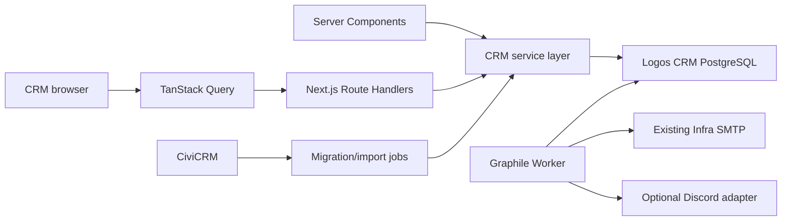

# Logos CRM — Technical Specification

> Status: proposed v0.4
>
> App: `apps/logos-crm`
>
> Local port: `3004`

## Hosting constraint

Every production capability must be self-hostable. The application must not require Vercel, a managed database, managed authentication, a hosted queue, or a proprietary deployment platform. External services may be configured as optional adapters, but the core application must run on infrastructure controlled by Logos.

## 1. Purpose and scope

`logos-crm` is the long-term Logos CRM application. It starts as a new, independently deployable CRM with its own PostgreSQL database and gradually absorbs the workflows currently served by `apps/civi-crm`.

The application is not a wrapper around CiviCRM. CiviCRM remains an integration and migration source during the transition, then becomes removable once all required workflows and data have been cut over.

### v1 scope

- authenticated internal CRM workspace;
- people, organisations, relationships, cases, assignments, and activities;
- tasks and follow-ups with due dates, assignees, and overdue views;
- global search, duplicate detection, and controlled person/organisation merges;
- Ecodev sales-opportunity case management with a focused v1 field set;
- leadership reports, filtered CSV/XLSX exports, and cross-team visibility;
- `@mention` notifications through the existing Infra SMTP and an optional Discord bot;
- role-based access control and an audit trail;
- REST API under `/api/v1/*`;
- asynchronous email and Discord notifications;
- import, reconciliation, and migration tooling for existing CiviCRM data.

### Non-goals for v1

- public CRM access;
- replacing the public website or CMS;
- modifying `apps/civi-crm` in place;
- supporting multiple CRM databases;
- exposing CiviCRM credentials to browser code.
- a full long-tail Ecodev taxonomy in v1.
- file attachments, real-time WebSockets, and a custom role-builder UI.

## 2. Repository placement

```text
apps/
  logos-crm/
    docs/
    src/app/
    src/components/
    src/features/
    src/server/
    scripts/
```

Keep the first implementation inside `apps/logos-crm`. Feature modules own UI composition; `src/server` owns database schema, services, authorisation, integrations, and worker tasks. Do not add `packages/crm` until another app has a demonstrated need to consume the same domain code and the package is explicitly approved.

## 3. Technology decisions

| Concern               | Decision                                                          |
| --------------------- | ----------------------------------------------------------------- |
| Framework             | Next.js 16 server runtime, App Router, React 19, TypeScript       |
| Database              | Dedicated PostgreSQL                                              |
| ORM                   | Drizzle ORM with `node-postgres`                                  |
| Server API            | Next.js Route Handlers under `/api/v1/*`                          |
| Server-rendered reads | Server Components call services directly                          |
| Client data           | TanStack Query v5 and TanStack Table                              |
| Validation            | Drizzle-generated Zod schemas plus business refinements           |
| Forms                 | React Hook Form and Zod                                           |
| Jobs                  | Graphile Worker backed by the same PostgreSQL instance            |
| UI                    | `@acid-info/logos-ui`, `@acid-info/logos-tokens`, Tailwind CSS v4 |
| Authentication        | Infra-managed SSO proxy; app consumes trusted identity headers    |
| Authorisation         | CASL abilities enforced by services and reflected in the UI       |
| Internationalisation  | `next-intl`, English first                                        |
| Tests                 | Vitest, PostgreSQL integration tests, Playwright                  |

The app follows the repository's Node 24, pnpm 11.1, Turborepo, ESLint, and TypeScript conventions.

Unlike `apps/web`, `apps/logos-crm` is not a static export. It runs `next start` in Docker Compose because authenticated Server Components, Route Handlers, downloads, and health routes require a server runtime.

### Proposed package set

| Package                                          | Scope                 | Reason                                                               |
| ------------------------------------------------ | --------------------- | -------------------------------------------------------------------- |
| `@acid-info/logos-ui`                            | workspace runtime     | Existing Logos components and icons                                  |
| `@acid-info/logos-tokens`                        | workspace runtime     | Existing Logos design tokens                                         |
| `react-aria-components`                          | shared UI runtime     | Accessible behaviour for new Logos CRM primitives                    |
| `next`, `react`, `react-dom`, `next-intl`        | app runtime           | Repository-standard application and i18n stack                       |
| `@tanstack/react-query`                          | app runtime           | Interactive client reads and mutations                               |
| `@tanstack/react-table`                          | app runtime           | Server-filtered operational tables                                   |
| `nuqs`                                           | app runtime           | Typed URL filter, sort, and pagination state                         |
| `react-hook-form`, `@hookform/resolvers`, `zod`  | app/runtime contracts | Forms and shared validation                                          |
| `recharts`                                       | app runtime           | Local report visualisation without a hosted analytics service        |
| `drizzle-orm`, `pg`                              | server runtime        | Typed PostgreSQL access                                              |
| `@casl/ability`                                  | app/server runtime    | Shared RBAC and record-level ability evaluation                      |
| `graphile-worker`                                | server runtime        | PostgreSQL-backed jobs without Redis or a hosted queue               |
| `nodemailer`                                     | server runtime        | SMTP notifications                                                   |
| `exceljs`                                        | worker runtime        | Modern XLSX generation                                               |
| `pino`                                           | server runtime        | Structured logs compatible with the existing internal dashboard      |
| `papaparse`                                      | server runtime        | CSV parsing and generation using the established dashboard pattern   |
| `drizzle-kit`, `drizzle-seed`                    | development           | Generated SQL migrations and deterministic development/test fixtures |
| `vitest`, `@playwright/test`, `@types/papaparse` | development           | Unit, integration, browser, and CSV type coverage                    |

Drizzle table definitions are the database source of truth. Use `drizzle-zod` to derive select, insert, and update schemas, then add only business-specific refinements. Infer TypeScript request and response types from those Zod schemas instead of maintaining parallel interfaces. Use `drizzle-kit generate`, `drizzle-kit check`, and `drizzle-kit migrate`; do not maintain a second schema, migration runner, or handwritten model type hierarchy. Use `drizzle-seed` for deterministic development and integration-test fixtures.

Next.js Route Handlers own the REST boundary. Shared Zod schemas validate request and response data, and one small `api-client` helper centralises JSON parsing and the common error envelope for TanStack Query. PapaParse owns CSV parsing and generation; ExcelJS owns XLSX generation. Discord delivery uses the native `fetch` API because the integration only needs a small number of REST calls. The requested Excel export is XLSX; legacy binary `.xls` is out of scope unless a downstream consumer proves it is required.

Prefer package capabilities over local infrastructure code. Do not build a generic base repository, custom migration framework, queue abstraction, CSV encoder/parser, permission engine, API client generator, URL-state serialiser, or retry scheduler. Small CRM business rules and focused Drizzle query modules remain application code.

Package reuse does not justify another service or framework layer. Dependencies must run inside the existing web or worker process, support Node 24, be pinned through the workspace lockfile, and pass licence and vulnerability review before implementation. A package is not added when a platform API or an existing selected package already covers the requirement clearly.

The CRM deliberately does not use Redis, Upstash, Vercel KV, or another message broker. PostgreSQL stores application data and Graphile Worker jobs. The existing `admin-acid` implementation is a reference for SMTP, structured logging, dashboard tables, CSV progress feedback, and confirmation flows only; its Redis and password-gate authentication are not reused.

## 4. Runtime architecture



Next.js Route Handlers validate input, resolve the authenticated identity, enforce authorisation, and call services. Services own CRM business rules and Drizzle transaction boundaries. Browser code uses the shared API client and never calls CiviCRM directly.

The web process and worker are separate runtime processes, even though they live in the same app package. Deployments must be able to restart or scale them independently. The only supported deployment target is Docker Compose on a Logos-controlled Linux host.

## 5. Authentication and authorisation

Infra authenticates users before traffic reaches the CRM. The app reads proxy-injected identity through one server-only auth seam and has no direct identity-provider integration. Header names are deployment configuration; the email default follows the existing `x-auth-request-email` convention. Infra must strip client-supplied identity headers, inject an immutable subject and email, and add a shared proxy-verification header that the app validates on every request.

The app must:

- reject requests with no authenticated identity;
- resolve the trusted external subject and email to a local `users` record;
- never trust a browser-supplied user or role;
- apply RBAC in services as well as at the UI boundary;
- record the acting user on every mutation and audit event;
- allow a local-only development identity mock that cannot activate in production;
- refuse production startup when the trusted proxy/header configuration is incomplete;
- use the immutable external subject as the identity key so email changes do not create duplicate users;
- create unknown but valid Infra identities as pending users with no data access until admin approval;
- deny access when either Infra or a CRM administrator suspends the user.

Initial roles:

| Role          | Scope                                                          |
| ------------- | -------------------------------------------------------------- |
| `admin`       | All CRM data, configuration, migration, and audit access       |
| `leadership`  | Cross-team reporting, shared records, and authorised exports   |
| `coordinator` | Assigned cases and permitted people/organisation records       |
| `operator`    | Operational records and activities without role administration |
| `viewer`      | Read-only access to permitted records                          |

Record-level restrictions must be explicit in the permission policy rather than inferred from UI visibility.

| Role          | Record scope                                                                                     | Mutations                                          | Additional capabilities                                            |
| ------------- | ------------------------------------------------------------------------------------------------ | -------------------------------------------------- | ------------------------------------------------------------------ |
| `admin`       | All records, including private activities                                                        | All business and administration mutations          | Users, teams, catalogues, merges, imports, audit, Discord mappings |
| `leadership`  | All cases and shared activities; no other user's private activities                              | Tasks and activities only where explicitly granted | Cross-team reports and exports                                     |
| `coordinator` | Assigned cases, team cases, related people/organisations, own private and team/shared activities | Cases, activities, and tasks within scope          | No cross-team reporting or administration                          |
| `operator`    | Team records and related entities, own private and team/shared activities                        | Activities and tasks within scope                  | No case configuration or administration                            |
| `viewer`      | Team records and shared activities                                                               | None                                               | No exports unless separately assigned a role that grants them      |

Capabilities include `cases:read`, `cases:write`, `activities:read`, `activities:write`, `tasks:read`, `tasks:write`, `people:merge`, `organisations:merge`, `cross_team:read`, `reports:read`, `exports:create`, `imports:manage`, `users:manage`, `teams:manage`, `catalogues:manage`, `audit:read`, and `discord_identities:manage`. Roles compile into server-authored CASL abilities; service methods check both the ability and record scope. Roles are fixed in v1, administrators assign roles but do not create arbitrary permission sets, and the server never accepts serialised ability rules from request data. Use a patched CASL release and lock it through the workspace lockfile.

## 6. Domain boundaries

The initial domain model is:

- `users` and `roles` — local identity and CRM permissions;
- `people` — individuals and contact details;
- `organisations` — entities and organisational contact details;
- contact methods and typed person-to-organisation relationships;
- `cases` — workflow records with an explicit status and owner;
- `case_assignments` — current and historical assignments;
- `activities` — notes, calls, meetings, and system actions;
- `tasks` — assigned follow-ups linked to a case, person, or organisation;
- activity visibility — `private`, `team`, or `shared`, enforced for timelines, reports, exports, and mentions;
- notification delivery records — audit and delivery state for Graphile Worker jobs;
- `audit_events` — append-only mutation history;
- `external_identities` — source-system IDs such as CiviCRM contact/case IDs;
- merge records — immutable mappings from duplicate records to the surviving record;
- `import_runs` — import checkpoints, mappings, errors, and reconciliation results.

Every imported record must retain its source system and source identifier. Migration code must be idempotent and must not use email as the sole durable identity key.

The concrete PostgreSQL entities, constraints, merge rules, visibility model, search indexes, and retention behaviour are defined in [`data-model.md`](data-model.md).

## 7. API conventions

All external API routes use `/api/v1`. Shared Zod schemas are the request and response contract; TypeScript types are inferred from them rather than duplicated manually. Responses must define:

- stable resource IDs;
- cursor or page-based pagination consistently per resource;
- validated filter and sort parameters;
- a common error shape with a machine-readable code;
- `created_at`, `updated_at`, and actor metadata where applicable;
- idempotency keys for externally retried mutations;
- optimistic-concurrency handling for conflicting edits.

The service layer is the canonical interface for Server Components; internal HTTP calls to the same Next.js process are prohibited. Client Components use a small shared `api-client` helper through TanStack Query. The helper handles JSON, the common error envelope, request IDs, and cancellation only; resource contracts remain Zod schemas next to their feature.

## 8. Reliability, privacy, and operations

- Worker jobs use Graphile Worker's built-in attempts, exponential backoff, `runAt`, `jobKey`, queues, cron, and graceful shutdown rather than application-owned scheduling or retry code.
- Business transactions enqueue Graphile Worker jobs directly in the same PostgreSQL transaction; there is no second outbox dispatcher.
- Notification delivery is idempotent and recorded separately from the Graphile Worker queue.
- Database migrations run as an explicit release step before the web process starts.
- Production backups and restore drills are required before importing authoritative data.
- Contact data and Discord identifiers are treated as personal data.
- Audit events are append-only and access to them is role-restricted.
- Logs must exclude tokens, passwords, and unnecessary personal data.
- Health checks must cover both the web process and worker/database connectivity.
- Email reuses the Infra SMTP credentials and Nodemailer contract already used by `admin-acid`; the CRM does not deploy its own SMTP service or add a provider-specific API.
- Container images, database migrations, backups, restore scripts, and an environment-variable reference must be included before production launch.

## 9. Acceptance criteria for implementation

Before v1 is considered ready:

1. Users authenticated by the Infra-managed proxy receive the correct local CRM role.
2. RBAC is enforced by API tests, service tests, and browser flows.
3. A case can be created, assigned, updated, and audited transactionally.
4. A task can be assigned, marked complete, and surfaced as overdue.
5. Duplicate people and organisations can be reviewed and merged without losing links or external IDs.
6. A notification can be transactionally queued, retried, and safely deduplicated without Redis.
7. Leadership metrics reproduce fixed reporting fixtures and filtered exports match visible data.
8. A representative CiviCRM export can be imported twice without duplicate records.
9. Reconciliation reports every unmapped or conflicting source record.
10. Backup restore and migration rollback have been tested.
11. The public website and existing `apps/civi-crm` behaviour remain unchanged until cutover is approved.

## 10. Source requirement coverage

| Source                                                                 | Required outcome                                              | Specification coverage                                                  |
| ---------------------------------------------------------------------- | ------------------------------------------------------------- | ----------------------------------------------------------------------- |
| [status-web#1176](https://github.com/status-im/status-web/issues/1176) | Ecodev list/detail and focused sales-opportunity fields       | Typed Ecodev detail model, list/detail UI, field and history rules      |
| [status-web#1178](https://github.com/status-im/status-web/issues/1178) | Leadership reporting, filtered exports, cross-team visibility | Report definitions, status/stage history, capabilities, CSV/XLSX jobs   |
| [status-web#1179](https://github.com/status-im/status-web/issues/1179) | `@mention` email/Discord notifications                        | Coordinators API, activity mentions, Graphile delivery jobs, deep links |

## 11. Decisions required before implementation

- Confirm the Ecodev stage/substatus catalogue and valid transitions.
- Map statuses to active-onboarding, approved, redirected, and other reporting categories.
- Confirm which roles and teams receive `cross_team:read`, `reports:read`, and `exports:create`.
- Confirm the Discord bot owner, permitted channels, direct-message policy, and user-mapping administration workflow.
- Confirm whether any consumer strictly requires legacy `.xls`; otherwise implement CSV and XLSX only.
- Confirm export retention and maximum row/file limits for the initial deployment.
- Confirm retention, anonymisation, and hard-deletion rules for personal data and audit events.
