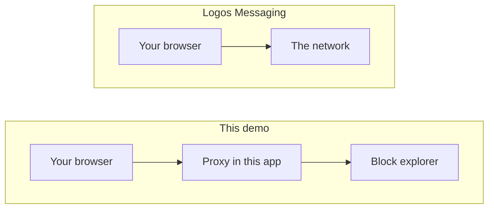
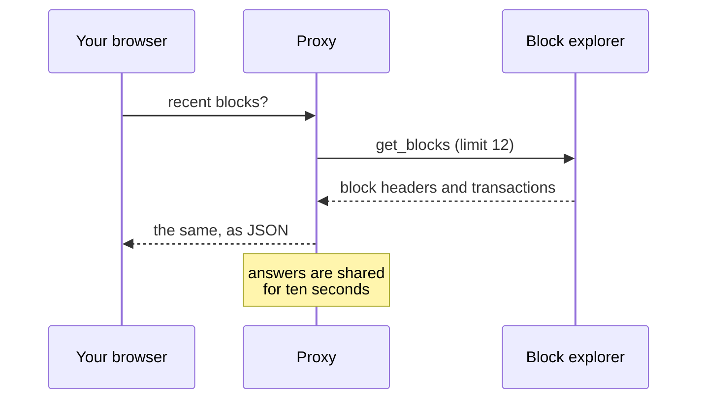

## What you are looking at

Each row is a real block from the Logos Execution Zone testnet: its number, its
hash, how many transactions it carried, and whether consensus has finalised it.

Blocks arrive about once a minute when the chain is producing. The badge at the
top says whether that is happening now, because a list of blocks looks identical
whether the newest one landed a minute ago or a week ago.

## This demo has a server in the path

The messaging demo has no backend. This one does, and it is worth being precise
about why.

The public block explorer answers requests happily, but it does not send the
header that lets a browser on another site read the response. That is a
deliberate default, not a fault. So the browser asks this app instead, and this
app asks the explorer, where that restriction does not apply.

What goes through the proxy is narrow on purpose: **public block data, read
only**. No key of yours, nothing you typed, and nothing written back.

## Where the data comes from

The explorer is someone else's testnet service, so the proxy caches for ten
seconds and the page polls every fifteen. A room full of people watching this
page produces about one request to the explorer per ten seconds, not one per
person.

## Why the chain might look idle

This is a testnet. It is restarted, upgraded and left alone between
experiments, and it has sat without producing a block for days at a time.

That is not the demo failing. It is what a test network looks like, and hiding
it would make the page less honest rather than more impressive.

## What is not here

No wallet, no transactions you can send, no account of your own. Those need
keys, and keys need a much more careful conversation than a read-only view of
public data.

| What | Where |
| --- | --- |
| Proxy route | `src/app/api/blockchain/blocks/route.ts` |
| Shapes and liveness | `src/lib/blockchain.ts` |
| Explorer endpoints and their quirks | `docs/network-access.md` |
