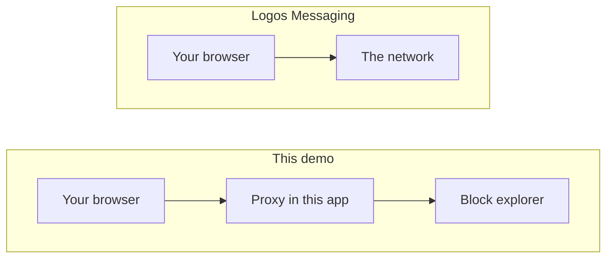
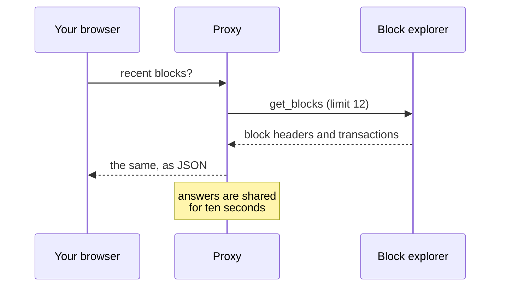

## What you are looking at

Each row is a real block from the Logos Execution Zone testnet: its number, its
hash, how many transactions it carried, and whether consensus has finalised it.

Blocks arrive about once a minute when the chain is producing. The badge at the
top says whether that is happening now, because a list of blocks looks identical
whether the newest one landed a minute ago or a week ago.

## This demo has a server in the path

The messaging demo has no backend. This one does, and it is worth being precise
about why.

The public block explorer answers requests happily, but it does not send the
header that lets a browser on another site read the response. That is a
deliberate default, not a fault. So the browser asks this app instead, and this
app asks the explorer, where that restriction does not apply.

What goes through the proxy is narrow on purpose: **public block data, read
only**. No key of yours, nothing you typed, and nothing written back.

## Where the data comes from

The explorer is someone else's testnet service, so the proxy caches for ten
seconds and the page polls every fifteen. A room full of people watching this
page produces about one request to the explorer per ten seconds, not one per
person.

## Why the chain might look idle

This is a testnet. It is restarted, upgraded and left alone between
experiments, and it has sat without producing a block for days at a time.

That is not the demo failing. It is what a test network looks like, and hiding
it would make the page less honest rather than more impressive.

## Searching

One box covers everything, because the explorer works out for itself what a
query is:

| You type | You get |
| --- | --- |
| A block number, like `30017` | That block |
| A full transaction hash | That transaction, its program and the accounts it touched |
| An account address | Its balance, nonce and owning program |

An unrecognised query comes back empty rather than as an error. Note the
explorer's index runs behind the chain head, so something very recent can be
missing for a while even though it is confirmed.

Expanding a block in the list shows its transactions without asking the
explorer again: they arrive with the block.

## What is not here, and why

There is no wallet, nothing to send, and no account of your own.

That is not caution on our part. **The explorer has no write endpoint to call.**
Its seven server functions are six `get_*` and a `search`, and the node APIs
that could accept a transaction are not publicly reachable: the testnet
deployment sits behind a Github sign-in, and the fleet nodes do not expose their
HTTP ports.

Even with an open endpoint, sending a transaction here would mean holding a key
in the browser and producing a zero-knowledge proof for it. Both are real
pieces of work, and neither belongs in a demo whose point is that you can look
without installing anything.

| What | Where |
| --- | --- |
| Proxy route | `src/app/api/blockchain/blocks/route.ts` |
| Shapes and liveness | `src/lib/blockchain.ts` |
| Explorer endpoints and their quirks | `docs/network-access.md` |
