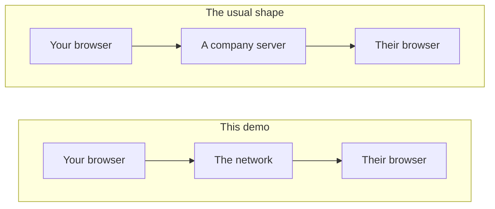
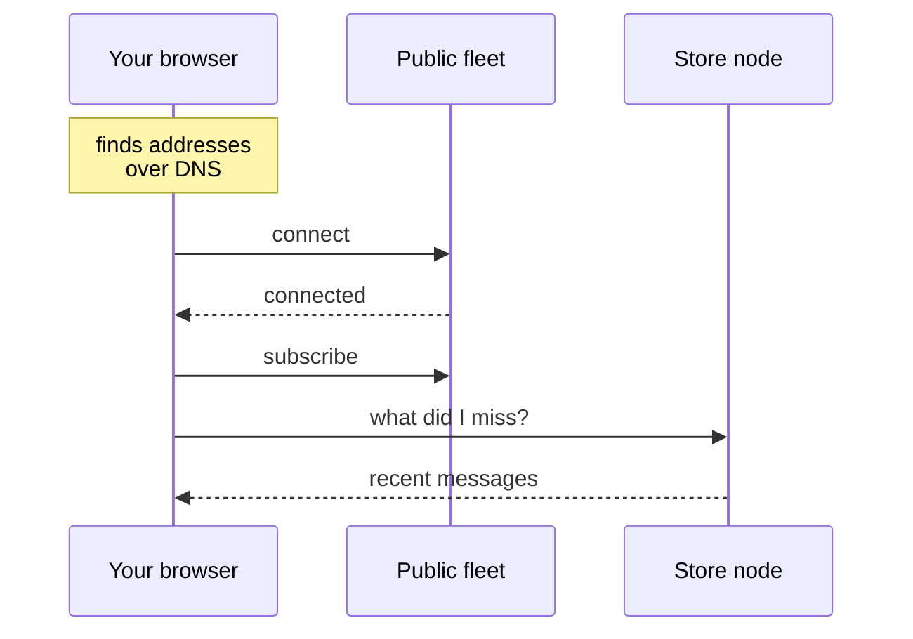
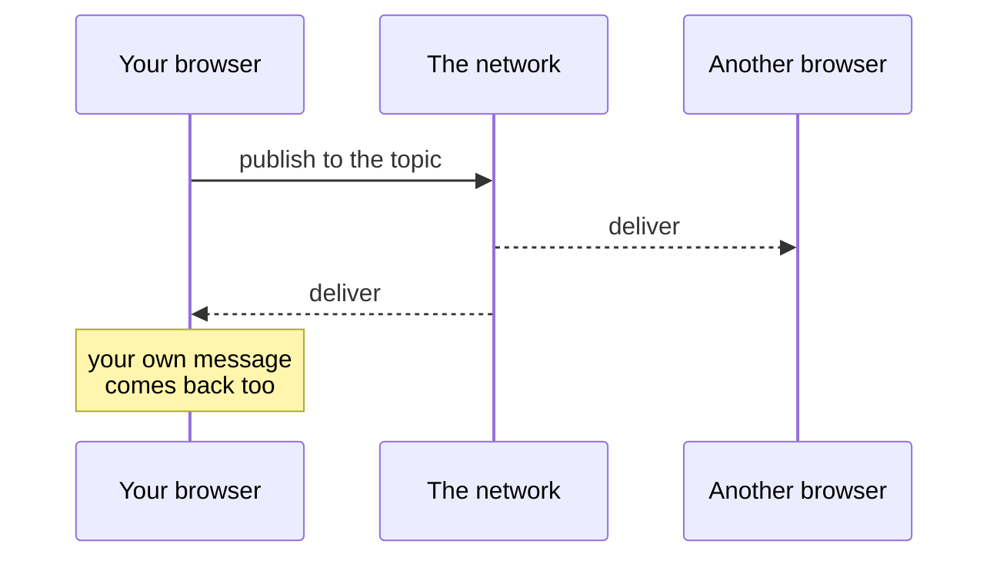

## There is no server in the middle

Most chat you have used works like the top row below. This demo works like the
bottom row.

The page you are reading is a static file. Once it has loaded, nothing you do
here goes through anything we run. Your browser is a participant in the
network, not a client of ours.

## What happens when you open the page

Your browser starts a light node. A light node does not relay other people's
traffic, which is what makes it small enough to live in a tab: it asks a few
full nodes to push messages to it and to publish on its behalf.

The peer count in the panel is that list turning into real connections. It sits
at zero for a few seconds while discovery and dialling happen, which is why the
demo looks empty before it looks alive.

## Sending a message

There is no "send to person" step, because there is no address book and no
recipient. A message is published to a **content topic**, and every node
listening to that topic receives it.

The topic is the room. Anyone listening to the same topic is in it.

## Why a tab that joins late is not empty

Live delivery only carries what is published from the moment you subscribe. A
tab opened an hour later would show nothing, which reads as broken.

Some nodes keep recent traffic for a retention window, so the browser asks them
for the backlog as soon as it connects. It subscribes first and asks second, so
a message published during the query is still caught live.

## What this does not hide

The topic is public. Anyone running this page reads the same messages, so treat
it as a room with the door open. Encrypted rooms come next, addressed by a link
that carries the key after the `#`, which browsers never send to a server.

Nothing published can be deleted. There is no delete to call, and no server of
ours holding a copy to remove. It ages out of retention or it stays.

## The code

| What | Where |
| --- | --- |
| Protocol wrapper, no React | `src/lib/waku.ts` |
| Node lifetime and subscriptions | `src/components/use-waku-node.ts` |
| This explainer | `src/demos/messaging/how-it-works.md` |
