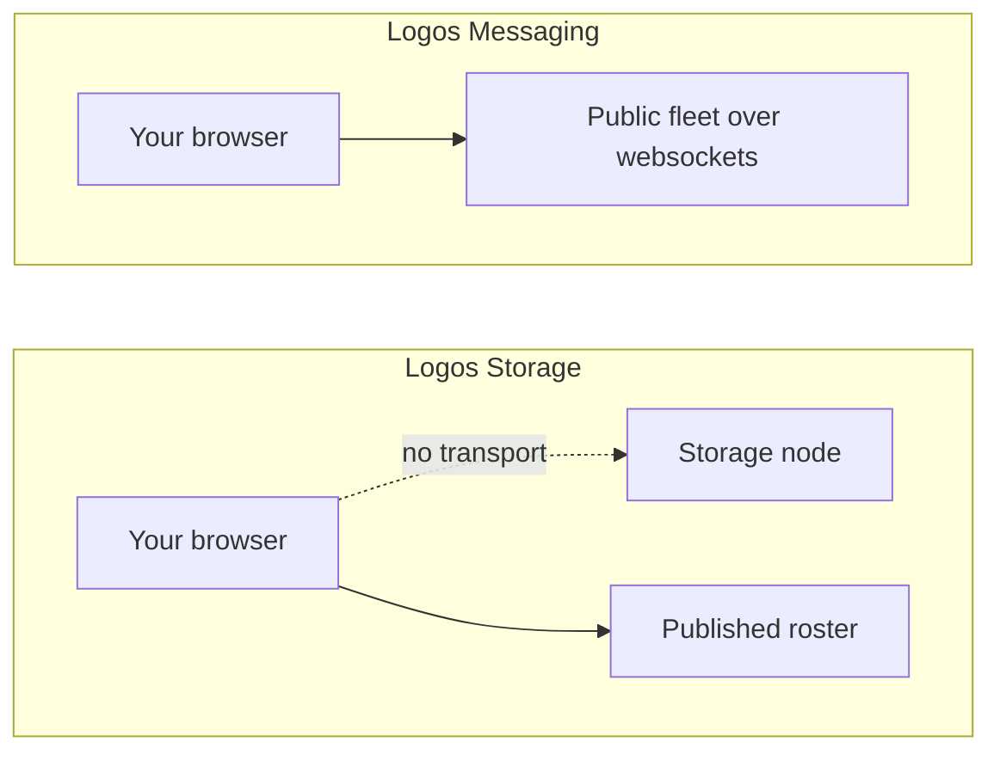
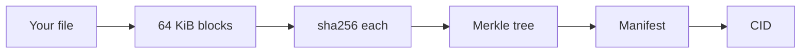

## What this is, and what it is not

This page does two things, and both are Logos Storage. It gives a file **the
exact address the network would give it**, worked out here in the browser. And
it shows **who runs the network**, read from the roster the project publishes.

It does not store your file, here or anywhere. Nothing on this page uploads
anything, and your file never leaves the tab. That limit is worth stating
plainly, because a storage demo that cannot store looks like a broken one until
you know why.

## Why you cannot upload

A browser cannot join Logos Storage. Discovery happens over discv5, which is
UDP, and content moves over libp2p TCP. A browser has neither, and the storage
documentation never mentions a websocket transport, so there is nothing to ask
for.

That is the difference from messaging, where two things were true at once: a
browser light client exists, and there is a public fleet speaking a transport
browsers have.

Nor is there a public node to call instead. Twelve were checked across both
fleets, and none of them will talk to us. Their ports are open, but only to
addresses on a list we are not on, so a browser gets nothing either way. The
storage documentation is entirely about running your own node.

## What this page can actually do

A CID is not something the network hands out. It is a pure function of the
bytes, so the same file has the same address everywhere, forever. That part a
browser can do in full, and this page does: it chunks the file into 64 KiB
blocks, pads the last one, hashes each, folds them into a merkle tree, builds
the manifest, and hashes that.

The result is checked, not asserted. A real node (v0.4.5, the published
binary) was run locally and fed the same inputs, and its answers are the
fixtures in `storage-cid.test.ts`. Ten cases, including the odd block counts
where the tree's key byte changes, and the file never leaves your tab.

## Proving a block without the file

Storing something is only half of it. A network that pays nodes to keep files
has to keep asking whether they still have them, and the answer cannot be
"trust me".

So a node is asked for a block at random. It answers with that block and the
handful of sibling hashes on the path from it to the root. Those fold back up
to the address the file already has, and anyone can check the fold. A node that
quietly dropped the block cannot produce the path.

That is what the **Prove one block** panel does, for whichever block you pick.
Five blocks needs three sibling hashes; a thousand needs ten. The proof grows
with the logarithm of the file, not the file.

This is the same code path the node runs, ported from nim-merkletree, and the
roots it folds to are the ones a real node published.

## Why the type sometimes says none

A node will not accept any Content-Type. It looks the value up in a table of
known file types and refuses anything it cannot place. `text/markdown` is one of
those, and browsers report it for every `.md` file, so dropping a README hits
it. Uploading with no type at all is allowed, and the manifest then records
none, so that is the upload the address describes. The page says which type was
refused.

## What is live

The roster itself, published at `fleets.logos.co`. It sends no CORS header, so
the browser is not allowed to read it directly and a small route handler fetches
it instead and passes it through unchanged.

Each entry carries the node's host, its libp2p peer id, its address, and the
keys another node needs to reach it. Two fleets are published, and
`logos.test` is the populated one.

## The mix relay column

These storage nodes double as **mix relays**. The official guide for running a
node builds its mix pool straight out of this roster, mapping every entry to a
relay with its `mixPubKey`. So the list you are looking at is also how a
joining node finds the mix network.

## About the role codes

The roster publishes a `role` of `mp` or `rs`. No source in any Logos
repository defines what they stand for, so they are shown exactly as published
rather than expanded into a guess.

## What would change this

Storage's marketplace runs on Ethereum contracts, and a browser can read an
Ethereum RPC directly. That would allow a real view of storage deals with no
node and no proxy. The contract address is known and so is the chain, Status
Network Sepolia. The one RPC published for that chain no longer resolves, which
is the only thing standing in the way.

| What | Where |
| --- | --- |
| Roster shapes | `src/lib/storage-fleet.ts` |
| Everything checked, and the open lead | `docs/storage-research.md` |
