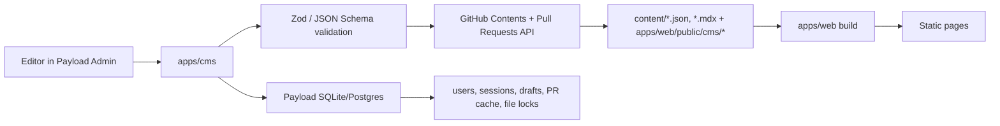

# Payload CMS + GitHub Content Plan

This document defines the schema, services, and implementation plan for using `apps/cms` as a Payload CMS editing interface for `apps/web` navigation, footer, and website copy, while treating GitHub as the source of truth for Builders Hub and Circles content.

Reference screens (verification pending — see §1 "Figma Node Verification"):

- Builders Hub: Figma `40009046:23948`, `40009046:24754`, `40009046:25012`
- Circles: Figma `40009046:25359`, `40009046:26015`
- Existing page requirements: [web-pages.md](./web-pages.md)
- Existing component requirements: [components.md](./components.md) — canonical Figma node IDs live here once reconciled
- Operational deployment notes (Vercel for dev/staging, self-hosted Node for production, env vars, troubleshooting): [deployment.md](./deployment.md)

## 1. Decisions

### Source of Truth

The repository content files are the production data source.

- Payload DB stores users, sessions, temporary drafts, and PR status cache only.
- Production data changes must be represented as GitHub commits or PR diffs.
- Schema changes must go through code review as normal code PRs.
- Content edits and new data entries should be created from Payload Admin as branch + PR changes.
- `develop` is the staging branch and the base branch for every change.
- `master` is the production branch.
- Direct commits to `develop` and `master` are blocked through GitHub branch protection. The CMS cannot enforce this on its own; branch protection must be configured at the GitHub repository level.

### Branch Strategy Adoption

This plan adopts a `develop`-first flow. Both `develop` (default branch, staging) and `master` (production) exist on the canonical repo. CMS-generated PRs always target `develop`; `master` is reached through a separate promotion PR.

- `develop` is the default branch and the staging deploy source.
- `master` is the production deploy source.
- Configure branch protection on both `develop` and `master`: require PR review, block direct push.
- All CMS-generated PRs target `develop`.
- A separate `release` PR promotes `develop` to `master` on a controlled cadence.

### Web Consumption Model

`apps/web` must not call the GitHub API at request time.

- The web app reads local content files during build.
- Preview deployments build from PR branches; the host must produce a per-PR URL reviewers can open. Vercel covers this in dev/staging; self-hosted production replaces it with whatever PR-preview pipeline the production host runs (e.g. ephemeral container per PR).
- Staging deploys from `develop`.
- Production deploys from `master`. The production target is **self-hosted Node** (Next.js standalone build); Vercel is used only for dev/staging.

This fits the current static Next.js structure and keeps runtime reliability independent from GitHub availability.

### Locale Policy

The repository routing is locale-aware (`apps/web/app/[locale]/...`) and the i18n stack is `next-intl`. Content schemas, file layout, and loaders are locale-aware from day one, even though the runtime currently only ships English.

- The `Language` type is a union pre-declared as `'en' | 'fr' | 'ko'` so adding a locale is a routing change, not a schema change.
- The **active locale list** is `routing.locales` from `apps/web/i18n/routing.ts`, read at build time. Today that is `['en']`.
- "Required locale" elsewhere in this document means "locale present in `routing.locales`". Files for non-active locales (e.g. `fr.json` while only `en` is active) are neither required nor read.
- When a locale is added to `routing.ts`, the corresponding `<locale>.json` files become required and a missing translation is a hard build error. There is no silent fallback.
- `messages/{locale}.json` keeps UI chrome and validation strings.
- `content/**/<locale>/...` holds page copy and structured data.

### Figma Node Verification

The Figma node IDs supplied for Builders Hub and Circles were reconciled directly against the Figma file (file key `qpsaED5iVKrOXoxwCWXuN3`):

| Plan reference   | Actual frame name                  | Status    |
| ---------------- | ---------------------------------- | --------- |
| `40009046:23948` | `Builders Hub` (1440×4573)         | confirmed |
| `40009046:24754` | `Builders Hub / Ideas` (1440×2160) | confirmed |
| `40009046:25012` | `Builders Hub / RFPs` (1440×2438)  | confirmed |
| `40009046:25359` | `Circles` (1440×4160)              | confirmed |
| `40009046:26015` | `Circles Detail Page` (1440×2014)  | confirmed |

The earlier conflict with `docs/components.md` (which listed `40009046:23948` as Footer desktop) was a stale entry in components.md, not a node-ID mismatch in this plan. Update `docs/components.md` so Footer desktop points at its actual node and Builders Hub points at `40009046:23948`.

Note on Figma layer names: many sections inside these frames are named `Tech stack` in Figma. That layer name is a generic section-wrapper convention in this design file, not a reference to the `/technology-stack` page. Treat layer names as descriptive only.

### Media Storage

Phase 1 stores all uploaded media inside the repository under `apps/web/public/cms/<type>/<slug>/<file>`. Editors upload through Payload; the CMS commits the binary alongside the JSON change in the same PR.

- Acceptable file types: `png`, `jpg`, `webp`, `svg`, `mp4` (small).
- Hard size cap per file: 2 MB. Larger uploads are rejected with a clear message.
- `MediaRef.src` stores the absolute path from `apps/web/public`, e.g. `/cms/circles/los-angeles/cover.webp`.
- An external storage migration (S3 / R2 / similar) is planned. The `MediaRef` shape and loader API are designed so that the migration only swaps the storage adapter, not the schema.

### Package and Naming

- Shared content package name: `@repo/content`.
- Content directory at the repo root: `content/`.
- Branch prefix for CMS PRs: `content/`.
- File renames performed during this work: `apps/web/components/site-headaer.tsx` becomes `apps/web/components/site-header.tsx` as part of Phase 2.

## 2. Target Architecture



### Repository Layout

The content tree is locale-aware for any data that contains user-visible copy. Data that is intrinsically locale-agnostic (geographic coordinates, IDs, structural relations) lives outside the locale folder, and locale-specific labels live alongside.

```txt
content/
  site/
    <locale>/
      settings.json
      navigation.json
      footer.json
  pages/
    <locale>/
      home.json
      technology-stack.json
      technology-stack-storage.json
      technology-stack-messaging.json
      technology-stack-blockchain.json
      technology-stack-networking.json
      builders-hub.json
      circles.json
      about.json
      take-action.json
      node-programme.json
      book.json
      links.json
      faq.json
      work-with-us.json
      brand-guidelines.json
      press.json
      blog.json
      terms.json
      privacy.json
      security.json
  builders-hub/
    settings/
      <locale>.json
    rfps/
      secure-decentralised-frontends/
        index.json            # locale-agnostic fields (slug, reward, applyUrl, dates)
        <locale>.json         # title, summary, description per locale
    ideas/
      quadratic-voting-platform/
        index.json
        <locale>.json
    resources/
      <locale>.json
  circles/
    settings/
      <locale>.json
    circles/
      los-angeles/
        index.json            # coordinates, timezone, joinUrl, status
        <locale>.json         # name, description per locale
    events/
      los-angeles-circle-4/
        index.json            # startsAt, endsAt, circleSlug
        <locale>.json
    initiatives/
      logos-powered-nextdoor-app/
        index.json
        <locale>.json
    resources/
      <locale>.json
```

The split between `index.json` (locale-agnostic) and `<locale>.json` (per-locale) prevents duplicating coordinates, dates, or relations across locale files when a translation is added.

### Shared Package Layout

Content types, validation, loaders, and GitHub mutations live in `@repo/content` instead of being duplicated across apps.

```txt
packages/content/
  src/
    schemas/
      common.ts          # MediaRef, CTA, Language, PublishState, schemaVersion helpers
      site.ts
      pages.ts           # PageCopy with typed `componentType` sections + PageSeo
      builders-hub.ts
      circles.ts
    loaders/
      site.ts
      pages.ts
      builders-hub.ts
      circles.ts
    locales/
      registry.ts        # reads routing.ts at build time, drives required-locale check
    github/
      client.ts
      mutations.ts
      pull-requests.ts
      locks.ts           # detects open PRs touching a path
    media/
      adapter.ts         # interface
      repo-adapter.ts    # Phase 1: writes to apps/web/public/cms/*
      external-adapter.ts# Phase 6: S3 / R2
    index.ts
```

`apps/cms` and `apps/web` use the same schemas and loaders. Data that passes CMS validation must pass the same validation during web builds.

## 3. Payload CMS Model

### Globals

#### Site Settings

The current `siteSettings` global only contains `siteName` and `siteDescription`. It is expanded into a structured site settings model.

```ts
type SiteSettings = {
  schemaVersion: 1
  language: Language
  siteName: string
  siteTitle: string
  siteDescription: string
  canonicalUrl: string
  keywords: string[]
  defaultOgImage?: MediaRef
  social: {
    twitter?: string
    discord?: string
    youtube?: string
    github?: string
  }
}
```

#### Navigation

Move `SITEMAP` and `COMMUNITY` out of `apps/web/components/site-header.tsx` and into CMS-managed content. Press thumbnails on the open overlay come from the `Press` collection, not from a separate Navigation field.

```ts
type Navigation = {
  schemaVersion: 1
  language: Language
  closedBar: {
    brandLabel: string // wordmark text shown left ("LOGOS")
    menuLabel: string // closed-state button text ("MENU")
    closeLabel: string // open-state button text ("CLOSE MENU")
    openAriaLabel: string // "Open navigation menu"
    closeAriaLabel: string // "Close navigation menu"
  }
  sitemap: NavLink[]
  communityCards: Array<{
    label: string
    href: string
    description: string
    image: MediaRef
  }>
  press: {
    label: string // section title in overlay ("Press")
    seeAllLabel: string // "SEE ALL"
    seeAllHref: string // /press
    visibleCount?: number // Press Engine query limit; UI applies default of 4 when omitted
  }
}
```

The Navigation loader reads only chrome labels and links from repo content. Article cards are fetched dynamically from Logos Press Engine at build time by the web app.

#### Footer

Move footer link groups and tagline out of `apps/web/components/site-footer.tsx` and into CMS-managed content.

```ts
type Footer = {
  schemaVersion: 1
  language: Language
  tagline: string
  image: MediaRef
  mainLinks: FooterLink[]
  socialLinks: FooterLink[]
  researchLinks: FooterLink[]
  infrastructureLinks: FooterLink[]
  legalLinks: FooterLink[]
  builtBy: {
    label: string
    attribution: string
    href?: string
  }
}
```

### Collections

#### Pages

The current `pages` collection only has `title`, `slug`, and `content`. Replace it with route-level structured copy where every section declares the component it renders. Freeform rich text is too loose for Figma-mapped sections, and a `Record<string, ...>` shape is too loose for editors — they cannot tell which fields a given section requires.

```ts
type PageCopy = {
  schemaVersion: 1
  language: Language
  route: string
  title: string
  description: string
  heading?: string
  seo?: PageSeo
  sections: PageSection[]
}

type PageSeo = {
  metaTitle?: string // overrides `title` for <title>
  metaDescription?: string // overrides `description` for meta description
  keywords?: string[]
  ogImage?: MediaRef
  noindex?: boolean
  canonicalUrl?: string
}

type PageSection =
  | HeroSection
  | RichTextSection
  | CardGridSection
  | TableSection
  | GiantSwitchSection
  | RelatedArticlesSection
  | CtaPanelSection
  | GallerySection
  | TechStackOverviewSection
  | CustomSection // escape hatch with explicit JSON schema

type HeroSection = {
  componentType: 'hero'
  key: string // e.g. 'home.atf'
  eyebrow?: string
  headline: string
  body?: string
  background?: MediaRef
  ctas?: CTA[]
}

type CardGridSection = {
  componentType: 'cardGrid'
  key: string
  heading?: string
  subheading?: string
  cards: Array<{
    title: string
    description?: string
    image?: MediaRef
    cta?: CTA
    showIcon?: boolean
  }>
}

type GiantSwitchSection = {
  componentType: 'giantSwitch'
  key: string
  accent: 'grey' | 'yellow'
  imagePosition: 'left' | 'right'
  title: string
  description: string
  image: MediaRef
  tags?: Array<{
    label: string
    icon?: 'wallet' | 'chat' | 'files' | 'explorer' | 'lambda' // names map to React SVG icons in @acid-info/logos-ui/icons
  }>
  primaryCta?: CTA
  secondaryCta?: CTA
}

type RelatedArticlesSection = {
  componentType: 'relatedArticles'
  key: string
  label?: string
  eyebrow?: string
  title: string
  cta?: CTA
  visibleCount?: number // Press Engine query limit; UI applies default of 4 when omitted
}

// Minimal placeholders for sections used today — full shapes filled in alongside Figma walkthrough.
type RichTextSection = { componentType: 'richText'; key: string; body: string }
type TableSection = {
  componentType: 'table'
  key: string
  title: string
  subtitle?: string
  action?: CTA
  rows: Array<{
    number?: string
    title: string
    description?: string
    reward?: { amount: number; currency: 'USDC'; xp?: number }
    cta?: CTA
  }>
}
type CtaPanelSection = {
  componentType: 'ctaPanel'
  key: string
  title: string
  description?: string
  image?: MediaRef
  cta: CTA
}
type GallerySection = {
  componentType: 'gallery'
  key: string
  items: Array<{ image: MediaRef; caption?: string; date?: string }>
}
type TechStackOverviewSection = {
  componentType: 'techStackOverview'
  key: string
  pillars: Array<{
    id: 'storage' | 'messaging' | 'blockchain' | 'userModules'
    title: string
    body: string
    href: string
  }>
  networkingTitle: string
  foundationTitle: string
}
type CustomSection = {
  componentType: 'custom'
  key: string
  customSchemaId: string // names a Zod schema registered in @repo/content/schemas/custom-sections
  payload: unknown // shape validated against the named schema at load time
}
```

Section `key` mirrors Figma section keys, for example `home.atf`, `home.techStack`, `buildersHub.heroSection`, `circles.heroSection`. The CMS form per `componentType` renders the matching field set, so editors never see "what does this Record key mean?".

Tech-stack sub-pages (`storage`, `messaging`, `blockchain`, `networking`) reuse `RelatedArticlesSection` so the four article cards on every sub-page resolve from the central `Press` collection.

## 4. GitHub Data Schema

### Shared Types

```ts
type Language = 'en' | 'fr' | 'ko'

type MediaRef = {
  src: string // absolute path from apps/web/public, e.g. /cms/...
  alt: string
  width?: number
  height?: number
  credit?: string
}

type CTA = {
  label: string // stored sentence case (e.g. "Join this circle"); component renders uppercase via CSS
  href: string
  external?: boolean
  variant?: 'primary' | 'secondary' | 'tertiary' | 'link' // default 'primary'
  iconOverride?: 'arrow-right' | 'arrow-left' | 'none' | string // default 'arrow-right'; back-link CTAs use 'arrow-left'
}

type PublishState = 'draft' | 'review' | 'published' | 'archived'

// Every persisted content type carries a schemaVersion from day one
// so that future migrations can detect and upgrade older payloads.
type WithSchemaVersion = { schemaVersion: number }
```

#### Ordering Convention

There are two cases:

- **Embedded arrays inside one JSON file** (e.g. `overviewLinks[]`, `actionPanels[]`, `communityCards[]`, `organizers[]`, `cards[]` inside a `CardGridSection`): array order is authoritative. No `order: number` field. Editors reorder by drag-and-drop, Payload writes the new array order back.
- **Collections of separate files** (e.g. RFP, Idea, Circle, CircleEvent, CircleInitiative, BuilderResource, CircleResource): each record may carry an optional `order?: number`. The loader sorts by `order` ascending, then `publishedAt` descending, then `slug` for tie-break. This is necessary because separate files have no inherent array position.

#### Identity and Slugs

`slug` is the canonical key for every record (locale-agnostic, lowercase kebab-case). The earlier `id: string` field is dropped from all schemas. Cross-references (`relatedIdeas`, `circleSlug`, `pinnedSlugs`) are slug-based.

#### Slug Renames

Slug renames are not supported through the standard editor flow. To rename a slug, an admin runs `pnpm --filter @repo/content rename-slug <type> <old> <new>`, which:

1. Renames the directory.
2. Sweeps every JSON file for references and rewrites them.
3. Adds an entry to a permanent `content/redirects.json` so the old URL 301s to the new one.

The CMS UI hides the slug field after creation and shows a "Rename via CLI" hint instead, to prevent accidental dead references.

#### Locale-Agnostic vs Localized Fields

Place names like `Circle.city`, `Circle.country`, `CircleEvent.venueName`, and `CircleEvent.address` are stored on `index.json` (locale-agnostic) and treated as English by default. When a locale that requires translated place names is activated, these fields move into the `<locale>.json` shape; the migration is documented as a Phase 5 schema bump because it changes the storage layout. Person names (`organizers[].name`, `submitter.name`, `author.name`) stay locale-agnostic indefinitely.

#### Date and Time Display

`startsAt`, `endsAt`, `publishedAt`, `submittedAt`, `closesAt` are always ISO 8601 in UTC. Surface-specific display strings are produced by the loader, not stored:

| Surface                                                                | Example                                                                | Generated by                                              |
| ---------------------------------------------------------------------- | ---------------------------------------------------------------------- | --------------------------------------------------------- |
| Circles index event group header                                       | `JANUARY 21 / WEDNESDAY`                                               | `formatEventDateForSurface(event, 'index-group', locale)` |
| Circles index event card (no date — date is in the group header above) | time row only: `12:00 PM · 6:00 PM GMT+1` (event-local · viewer-local) | `formatEventDateForSurface(event, 'index-card', locale)`  |
| Circle detail event card                                               | calendar row `February 22, 2026`, clock row `12:00 PM`                 | `formatEventDateForSurface(event, 'detail-card', locale)` |
| Press article card                                                     | `02.14.26`                                                             | Logos Press Engine response                               |

The index-card time row pairs the event's local time with the viewer's local time using the browser's `Intl.DateTimeFormat`. The detail-card surface omits viewer-local conversion to keep copy unambiguous when the page is shared.

`CircleEvent` carries `displayDateOverride`, `displayWeekdayOverride`, and `displayTimeOverride` strictly as escape hatches for events whose auto-formatted output is wrong (e.g. multi-day events, unusual venues). The CMS form leaves these blank by default; if filled, they take precedence on every surface uniformly.

#### Event Card Surface Mapping

| Surface                      | Date row                                              | Title                     | Location field used             | Avatar stack                                                         |
| ---------------------------- | ----------------------------------------------------- | ------------------------- | ------------------------------- | -------------------------------------------------------------------- |
| Circles index card (463×135) | none — date is in the date+weekday group header above | `CircleEventLocale.title` | `locationLabel` (city + region) | up to 3 avatars; missing slots fall back to grey placeholder circles |
| Circle detail card (702×234) | yes — calendar row + separate clock row               | `CircleEventLocale.title` | `venueName` (single venue)      | up to 3 avatars; missing slots fall back to grey placeholder circles |

### Builders Hub

The relevant screens are `/builders-hub`, `/builders-hub/ideas`, and `/builders-hub/rfps`. The content model needs RFPs, ideas, resources, and page-level CTA/banner settings.

#### BuilderHubSettings

Stored at `content/builders-hub/settings/<locale>.json`.

```ts
type BuilderHubSettings = {
  schemaVersion: 1
  language: Language
  hero: {
    title: string // "Logos Builders Hub"
    description?: string // right-side intro paragraph
    eyebrow?: string // small top-left label, optional
    backLink?: { label: string; href: string } // small "← <parent>" link above the hero
    topRightCta?: CTA // top-right utility CTA in the hero (e.g. external link)
  }
  overviewLinks: Array<{
    key:
      | 'ideas'
      | 'rfps'
      | 'resources'
      | 'github-issues'
      | 'contribute'
      | string
    title: string // "Ideas", "RFPs", etc.
    description: string // single-line summary shown to the right of the title
    primaryCta: CTA // first of the two CTAs on each row (60×17 in Figma)
    secondaryCta?: CTA // second CTA on each row (78×17 in Figma)
  }>
  // The home-page submit CTAs and the listing-page submit CTAs are intentionally
  // separate: the home page often shows shorter copy ("Submit") next to a section
  // header, while the listing page uses the full call-to-action ("Submit an RFP →")
  // in the hero. Keep both fields so editors can phrase each one for its surface.
  //
  // Figma shows a 2×4 RFP grid (7 RFP cards + 1 terminator tile cross-promoting Ideas)
  // and a 7-row Ideas table on the home page. The fields below let editors control
  // exactly which slugs appear on the home and how many slots are filled.
  rfpsSection: {
    title: string
    description?: string
    filterCta?: CTA
    seeAllCta: CTA
    submitCta?: CTA // home-page section header; listing page uses BuilderHubListingPageSettings.submitCta
    pinnedSlugs?: string[] // RFPs displayed on the home grid; loader fills remaining slots from latest published
    displayCount?: number // total tiles on the home grid (Figma default 7 RFP cards + 1 terminator = 8)
    terminatorCard?: {
      // last grid cell: cross-promotion tile with thumbnails of related items
      kind: 'see-all-rfps' | 'see-all-ideas'
      title: string // "See all ideas"
      thumbnailSlugs: string[] // 4 slugs from the linked collection (ideas / rfps)
      href: string // entire card is the click surface; Figma renders no inner CTA button
    }
  }
  ideasSection: {
    title: string
    description?: string
    seeAllCta: CTA
    submitCta?: CTA
    pinnedSlugs?: string[] // Ideas displayed on the home table; loader fills remaining slots from latest published
    displayCount?: number // number of rows on the home (Figma default 7)
  }
  appInstall: {
    accent: 'grey' | 'yellow' // GiantSwitch accent
    imagePosition: 'left' | 'right' // GiantSwitch image position
    title: string
    description: string
    tags: Array<{
      label: string
      icon?: 'wallet' | 'chat' | 'files' | 'explorer' | 'lambda'
    }>
    installCta: CTA
    learnMoreCta: CTA
    image: MediaRef
  }
  actionPanels: Array<{
    variant: 'image-overlay' | 'flat' // Figma shows two distinct treatments: rounded image-overlay (boilerplate apps) and flat dark-green pill (office hours)
    title: string
    description?: string
    image?: MediaRef // required when variant = 'image-overlay'
    cta: CTA
  }>
  officeHours?: {
    title: string
    description: string
    cta: CTA
  }
  resourcesSection: {
    title: string
    description?: string
    helpCenterCta?: CTA
  }
}
```

#### RFP

Locale-agnostic root at `content/builders-hub/rfps/<slug>/index.json`:

```ts
type RFPIndex = {
  schemaVersion: 1
  slug: string
  status: PublishState
  reward: {
    amount: number
    currency: 'USDC'
    xp?: number
  }
  applyUrl: string
  tags: string[]
  image?: MediaRef
  featured: boolean
  order?: number
  publishedAt?: string
  closesAt?: string
  owner?: {
    name: string
    handle?: string
  }
  relatedIdeas?: string[] // slug references; validated for existence at load time
}
```

Per-locale copy at `content/builders-hub/rfps/<slug>/<locale>.json`:

```ts
type RFPLocale = {
  language: Language
  title: string
  summary: string
  description: string
  ctaLabel?: string
}
```

`relatedIdeas` is a one-way reference. The reverse direction is computed by the loader at build time, not stored on `Idea`, to avoid two-sided sync drift.

#### Idea

Same split: `content/builders-hub/ideas/<slug>/index.json` and `<slug>/<locale>.json`.

```ts
type IdeaIndex = {
  schemaVersion: 1
  slug: string
  status: PublishState
  submitter: {
    name?: string
    handle: string // stored without leading '@'
  }
  reward?: {
    // Figma renders rewards on Idea rows in both the home table and the listing
    amount: number
    currency: 'USDC'
    xp?: number
  }
  image?: MediaRef
  tags: string[]
  featured: boolean
  order?: number
  submittedAt?: string
  discussionUrl?: string
}

type IdeaLocale = {
  language: Language
  title: string
  summary: string
  description: string
  ctaLabel?: string
}
```

`Idea.relatedRfps` is dropped from the schema. Reverse links are computed by the loader from `RFP.relatedIdeas`.

#### BuilderResource

The Builders Hub resources list lives in a single per-locale file `content/builders-hub/resources/<locale>.json` shaped as:

```ts
type BuilderResourcesFile = {
  schemaVersion: 1
  language: Language
  items: BuilderResourceLocale[]
}

type BuilderResourceLocale = {
  slug: string // unique within this collection
  title: string
  description: string
  ctaLabel: string
  href: string // duplicated across locale files; loader warns on divergence
  status: PublishState // duplicated across locale files; loader warns on divergence
}
```

Resources are kept simple (per-locale flat) rather than split into `index.json + <locale>.json` because there is no `image`, `coordinates`, or other heavy locale-agnostic state worth deduplicating. The loader emits a warning in CI if `href` or `status` for the same `slug` diverges between locale files. Same shape applies to `CircleResource`.

#### BuilderHubListingPageSettings

```ts
type BuilderHubListingPageSettings = {
  schemaVersion: 1
  language: Language
  page: 'ideas' | 'rfps'
  title: string
  description: string
  breadcrumbLabel: string
  submitCta: CTA
  defaultView: 'grid' | 'list'
  pageSize: number
  pagination: {
    previousLabel: string
    nextLabel: string
  }
  bottomCta: {
    title: string
    cta: CTA
  }
}
```

#### Detail Page Decision

`apps/web` currently routes `/builders-hub/rfps` and `/builders-hub/ideas` as listing pages only. Detail pages (`/builders-hub/rfps/[slug]`, `/builders-hub/ideas/[slug]`) are out of scope for Phase 1. The schema keeps `slug` and a full `description` so detail pages can be added later without a data migration. `applyUrl` and `discussionUrl` continue to be the primary user destinations until then.

### Circles

The relevant screens are `/circles` and `/circles/[slug]`. The content model needs circles, events, initiatives, resources, and map settings.

#### CirclesSettings

Stored at `content/circles/settings/<locale>.json`.

```ts
type CirclesSettings = {
  schemaVersion: 1
  language: Language
  hero: {
    title: string // "Logos Circles"
    description: string // long body copy on the right
    eyebrow?: string // small top-left label
    backLink?: { label: string; href: string } // small "← <parent>" link above hero
    topRightCta?: CTA // small top-right utility link
    findCta: CTA // primary bottom-left CTA ("Find a Circle Near You")
    joinCta: CTA // primary bottom-right CTA ("Start a Circle")
  }
  map: {
    defaultZoom: number
    defaultCenter: { lat: number; lng: number }
    image?: MediaRef // static-image fallback for Phase 1
    zoomInAriaLabel: string // aria-label for the icon-only zoom-in button
    zoomOutAriaLabel: string // aria-label for the icon-only zoom-out button
  }
  // Section between the map and the events list. The Figma copy ("These meetups are
  // essential for anyone taking actions with us...") matches messages.en.json
  // home.circlesCta.body, so this block is the find-a-circle-nearby CTA reused on
  // /circles. The Figma layer name "Header → Video: Powering Effective Crisis Response"
  // is a designer note, not the rendered headline.
  nearbyCta: {
    title: string // e.g. "Circles and Counting." (was home.circlesCta.headline)
    description?: string
    cta: CTA
  }
  eventsSection: {
    title: string
    description?: string
    calendarCta: CTA
  }
  initiativesSection: {
    title: string
    cta?: CTA
  }
  detailJoinCtaLabel: string // shared label for the hero Join button on every Circle detail page (Figma value: "Join this circle"). Stored sentence case; component uppercases.
  resourcesSection: {
    title: string
    description?: string
    helpCenterCta?: CTA
  }
}
```

#### Circle

`content/circles/circles/<slug>/index.json`:

```ts
type CircleIndex = {
  schemaVersion: 1
  slug: string
  status: PublishState
  city: string
  country: string
  region?: string
  coordinates: {
    lat: number
    lng: number
  }
  // GeoJSON-friendly accessor (loader computed): [lng, lat]
  timezone: string
  memberCount?: number
  discordChannel?: string // stored without leading '#'; UI prepends it (Figma displays "#circle-los-angeles")
  discordUrl?: string
  forumUrl?: string
  joinUrl: string
  image?: MediaRef
  organizers?: Array<{
    name: string
    handle?: string
    avatar?: MediaRef
  }>
  order?: number
  detailBackLink?: { label: string; href: string } // "← All circles" link above the detail-page hero (defaults to { label: 'All circles', href: '/circles' }; sentence case stored, CSS uppercases)
}

type CircleLocale = {
  language: Language
  name: string
  description: string
}
```

The loader exposes both `coordinates: { lat, lng }` and `coordinatesGeoJson: [lng, lat]` so map libraries get the order they expect without re-shaping at the call site.

#### CircleEvent

`content/circles/events/<slug>/index.json`:

```ts
type CircleEventIndex = {
  schemaVersion: 1
  slug: string
  status: PublishState
  circleSlug: string // must reference an existing circle
  startsAt: string // ISO 8601 in UTC — primary source of truth for all date/time rendering
  endsAt?: string
  timezone: string // IANA timezone for the event venue
  displayDateOverride?: string // escape hatch — only used when the auto-formatted date must be replaced (rare)
  displayWeekdayOverride?: string
  displayTimeOverride?: string
  venueName?: string // e.g. "Chateau Marmont"
  address?: string
  eventUrl?: string
  image?: MediaRef // shown on the detail-page card (702×234) and the index card (463×135)
  hostedBy: Array<{
    name: string // e.g. "InfinityBase Events"
    avatar?: MediaRef // small avatar shown in the host stack
  }>
  featured: boolean
  sequenceNumber?: number // optional series number, e.g. 5 → renders as "Los Angeles Circle #5". Loader auto-prefills max+1 within circleSlug.
}

type CircleEventLocale = {
  language: Language
  title: string // override; loader prefills from circle.name + sequenceNumber, e.g. "Los Angeles Circle #5"
  locationLabel: string // city + region shown on the index card with map-pin icon (e.g. "Florianópolis, Santa Catarina"). Detail card uses `venueName` instead.
}
```

#### CircleInitiative

`content/circles/initiatives/<slug>/index.json`:

```ts
type CircleInitiativeIndex = {
  schemaVersion: 1
  slug: string
  status: PublishState
  circleSlug: string
  href: string
  image: MediaRef
  featured: boolean
  order?: number
}

type CircleInitiativeLocale = {
  language: Language
  locationLabel: string
  title: string
  description: string
  ctaLabel: string
}
```

#### CircleResource

Stored at `content/circles/resources/<locale>.json`, same shape as `BuilderResourcesFile`:

```ts
type CircleResourcesFile = {
  schemaVersion: 1
  language: Language
  items: CircleResourceLocale[]
}

type CircleResourceLocale = {
  slug: string
  title: string
  description: string
  ctaLabel: string
  href: string
  status: PublishState
}
```

### Blog

Blog articles are not stored in repo content or edited through this CMS. The open-overlay Press section in the navbar, the homepage Press strip, the `/press` index, and every tech-stack sub-page's `Related Articles` block fetch article data from Logos Press Engine.

Repo content owns only surrounding chrome copy such as section labels, CTA labels, and `visibleCount`. Article title, author, image, date, and canonical URL come from `https://blog.logos.co/api/search`.

## 5. Figma Coverage Audit

The schemas in this plan were validated directly against the Figma file (file key `qpsaED5iVKrOXoxwCWXuN3`) for all five frames listed at the top of this document. Coverage tables below reflect that walkthrough. Before implementing each section, re-pull the matching Figma frame spec (fontSize, fills, gaps, padding) and verify that the content schema captures every text and image slot the design uses.

### Builders Hub Coverage

| Figma frame                   | Required content                                                                                     | Coverage                                                                                      |
| ----------------------------- | ---------------------------------------------------------------------------------------------------- | --------------------------------------------------------------------------------------------- |
| `40009046:23948` Builders Hub | Hero title, intro copy, optional eyebrow, optional back link, optional top-right CTA                 | `BuilderHubSettings.hero`                                                                     |
| `40009046:23948` Builders Hub | Top overview rows: Ideas, RFPs, Resources, GitHub Issues, Contribute, each with two CTAs             | `BuilderHubSettings.overviewLinks` (`primaryCta` + `secondaryCta`)                            |
| `40009046:23948` Builders Hub | Logos App Giant Switch content, tags, image, install CTA, learn-more CTA                             | `BuilderHubSettings.appInstall`                                                               |
| `40009046:23948` Builders Hub | RFP card grid (7 cards) + cross-promotion `See all ideas` terminator tile + filter CTA + see-all CTA | `BuilderHubSettings.rfpsSection` with `pinnedSlugs`, `displayCount`, `terminatorCard` + `RFP` |
| `40009046:23948` Builders Hub | Ideas table (7 rows on home)                                                                         | `BuilderHubSettings.ideasSection` with `pinnedSlugs`, `displayCount` + `Idea`                 |
| `40009046:23948` Builders Hub | Two large CTA panels: boilerplate apps and office hours                                              | `BuilderHubSettings.actionPanels` and `BuilderHubSettings.officeHours`                        |
| `40009046:23948` Builders Hub | Additional Resources table: Quick Start, Documentation, Boilerplates, Video Tutorials                | `BuilderResourcesFile` and `BuilderHubSettings.resourcesSection`                              |
| `40009046:24754` Ideas        | Breadcrumb, page header (logomark + title), submit CTA, grid/list toggle, default list view          | `BuilderHubListingPageSettings`                                                               |
| `40009046:24754` Ideas        | Ten list rows (no pagination — `pageSize` reaches list count)                                        | `Idea` plus listing settings                                                                  |
| `40009046:24754` Ideas        | Bottom CTA: `We want your ideas.`                                                                    | `BuilderHubListingPageSettings.bottomCta`                                                     |
| `40009046:25012` RFPs         | Breadcrumb, page header, submit CTA, grid/list toggle, default grid view                             | `BuilderHubListingPageSettings`                                                               |
| `40009046:25012` RFPs         | RFP cards and list rows with reward and apply CTA                                                    | `RFP`                                                                                         |

### Circles Coverage

| Figma frame                    | Required content                                                                                                      | Coverage                                                                                        |
| ------------------------------ | --------------------------------------------------------------------------------------------------------------------- | ----------------------------------------------------------------------------------------------- |
| `40009046:25359` Circles       | Hero title, intro copy, optional eyebrow + top-right CTA + back link, find/join CTAs                                  | `CirclesSettings.hero`                                                                          |
| `40009046:25359` Circles       | World map image (1432×926), city markers, two icon-only zoom buttons                                                  | `CirclesSettings.map` (with aria-only zoom labels) + `Circle.coordinates`                       |
| `40009046:25359` Circles       | Find-a-circle-nearby CTA block below the map (matches `home.circlesCta` body copy)                                    | `CirclesSettings.nearbyCta`                                                                     |
| `40009046:25359` Circles       | Upcoming events grouped by date + weekday header with divider                                                         | `CircleEvent.displayDate`, `displayWeekday`, `startsAt` + `getCircleEventsGroupedByDate` loader |
| `40009046:25359` Circles       | Index event card (463×135): location, date/time, venue, host stack, image                                             | `CircleEvent`                                                                                   |
| `40009046:25359` Circles       | Winnable Issues cards (3 across) with location label, title, body, CTA, background image                              | `CircleInitiative`                                                                              |
| `40009046:25359` Circles       | Circles Resources table: Start your own Circle, Forum, Discord                                                        | `CircleResourcesFile` and `CirclesSettings.resourcesSection`                                    |
| `40009046:26015` Circle detail | Back link "← Circles" above hero, city title (logomark + name), description, members/Discord/forum metadata, Join CTA | `Circle` + `Circle.detailBackLink`                                                              |
| `40009046:26015` Circle detail | Metadata rows: members count, Discord channel `#circle-...`, Forum URL                                                | `Circle.memberCount`, `discordChannel` (no leading `#`), `discordUrl`, `forumUrl`               |
| `40009046:26015` Circle detail | Detail event cards (702×234) with image, "Circle #N" title, date / time / location rows, host stack with avatars      | `CircleEvent` (incl. `sequenceNumber`, `hostedBy[].avatar`) filtered by `circleSlug`            |
| `40009046:26015` Circle detail | Two initiative cards (702×282) with location, title, body, CTA, image                                                 | `CircleInitiative` filtered by `circleSlug`                                                     |

### Tech Stack and Home Coverage

| Page                           | Required content                                                                                                                                             | Coverage                                                                                                                              |
| ------------------------------ | ------------------------------------------------------------------------------------------------------------------------------------------------------------ | ------------------------------------------------------------------------------------------------------------------------------------- |
| `/` Home                       | ATF hero, Build/Node/Circles triptych, About teaser, Tech stack, Use cases, App Install banner, Builder Portal, Editorial image, Press strip, Circles teaser | `PageCopy` with `hero`, `cardGrid`, `richText`, `techStackOverview`, `giantSwitch`, `ctaPanel`, `gallery`, `relatedArticles` sections |
| `/technology-stack`            | Hero, four pillar cards, networking + foundation rows, App Install banner, large circle image, Use cases                                                     | `PageCopy` with `hero`, `techStackOverview`, `giantSwitch`, `cardGrid` sections                                                       |
| `/technology-stack/storage`    | Hero, intro, builder CTA panel, related articles, sibling tech-stack overview                                                                                | `PageCopy` with `hero`, `richText`, `ctaPanel`, `relatedArticles`, `techStackOverview`                                                |
| `/technology-stack/messaging`  | Hero, intro, case studies, builder CTA panel, related articles                                                                                               | Same as above plus a `cardGrid` for case studies                                                                                      |
| `/technology-stack/blockchain` | Hero, privacy/cryptarchia explainers, builder CTA panel, related articles                                                                                    | Same as above plus a `cardGrid` for `blendNetwork` and `lez`                                                                          |
| `/technology-stack/networking` | Hero, intro, three feature cards, builder CTA panel, related articles                                                                                        | Same as above                                                                                                                         |
| `/press`                       | Engine label, list of latest articles                                                                                                                        | UI copy from translations plus Logos Press Engine data                                                                                |

### Home → Content Migration Map

The migration moves keys out of `apps/web/messages/en.json` into `content/pages/en/*.json`. UI chrome, validation strings, and label-only keys stay behind.

| messages.en.json path                                 | Content destination                                                                                                     |
| ----------------------------------------------------- | ----------------------------------------------------------------------------------------------------------------------- |
| `home.atf.*`                                          | `content/pages/en/home.json` → section `home.atf` (`hero`)                                                              |
| `home.build.*` / `home.node.*` / `home.circles.*`     | `content/pages/en/home.json` → section `home.triptych` (`cardGrid`)                                                     |
| `home.about.*`                                        | `content/pages/en/home.json` → section `home.about` (`richText`)                                                        |
| `home.techStack.*`                                    | `content/pages/en/home.json` → section `home.techStack` (`techStackOverview`)                                           |
| `home.useCases.*`                                     | `content/pages/en/home.json` → section `home.useCases` (`cardGrid`)                                                     |
| `home.parallelSociety.*` / `home.mountain.*`          | `content/pages/en/home.json` → section `home.parallelSociety` (`gallery`)                                               |
| `home.builderPortal.*`                                | `content/pages/en/home.json` → section `home.builderPortal` (`ctaPanel`)                                                |
| `home.press.*`                                        | `content/pages/en/home.json` owns the section label, CTA, and visible count; article rows come from Logos Press Engine. |
| `home.circlesCta.*`                                   | `content/pages/en/home.json` → section `home.circlesCta` (`ctaPanel`)                                                   |
| `pages.<route>.title/description/heading`             | `content/pages/en/<route>.json` → top-level `title`, `description`, `heading`                                           |
| `pages.<route>.hero.*` / `pages.<route>.intro.*` etc. | `content/pages/en/<route>.json` → matching section                                                                      |
| `footer.*`                                            | `content/site/en/footer.json`                                                                                           |
| `common.*`, `locale.*`                                | Stays in `messages/<locale>.json`                                                                                       |

The migration ships incrementally: each route can move independently. After a route migrates, its `pages.<route>.*` keys are deleted from `messages/<locale>.json` in the same PR.

## 6. Service Design

### Content Loader Service

Location: `packages/content/src/loaders/*`

Responsibilities:

- Read local `content/**` files.
- Validate data with Zod schemas.
- For each entity, merge `index.json` with the requested `<locale>.json`.
- Filter unpublished data for production builds.
- Normalize sort/order values.
- Resolve one-way references and compute reverse references (for example, `idea.relatedRfps` is derived from `rfp.relatedIdeas`).
- Return view models for `apps/web`.

Example API:

```ts
getNavigation(locale: Language)
getFooter(locale: Language)
getPageCopy(route: string, locale: Language)
getBuilderHubHome(locale: Language)
getRfps({ locale, status, page, pageSize })            // view is a render concern, not a loader concern
getIdeas({ locale, status, page, pageSize })
getCircles(locale: Language)
getCircleBySlug(slug: string, locale: Language)
getCircleEvents({ circleSlug, locale })
getCircleEventsGroupedByDate({ locale })          // returns Array<{ date, weekday, events: CircleEvent[] }> for the index page
getCircleInitiatives({ circleSlug, locale })
resolveBuilderHubHomeRfps(locale: Language)        // applies pinnedSlugs + displayCount + terminator card from BuilderHubSettings.rfpsSection
resolveBuilderHubHomeIdeas(locale: Language)       // applies pinnedSlugs + displayCount from BuilderHubSettings.ideasSection
formatEventDateForSurface(event, surface: 'index-group' | 'index-card' | 'detail-card' | 'press', locale)
                                                    // returns the surface-specific string ("JANUARY 21 / WEDNESDAY", "February 22, 2026", "02.14.26", etc.)
                                                    // formed from event.startsAt + timezone + locale unless an override field is set
```

A missing locale file is a build error, not a fallback. The CI step `content:validate` runs the loader against every supported locale and fails loudly if any required file is missing.

### Media Adapter

Location: `packages/content/src/media/*`

Responsibilities:

- Accept editor uploads from Payload Admin.
- Validate file type and size (2 MB hard cap in Phase 1).
- Persist the binary and produce a `MediaRef.src` value.

Phase 1 implementation: `repo-adapter.ts` writes the binary into `apps/web/public/cms/<type>/<slug>/<file>` and includes it in the same PR as the JSON change.

Phase 6 plan: a second adapter writes to external storage and returns a CDN URL. Switching adapters does not require any schema change because `MediaRef` is already an opaque `src + alt + dimensions` shape.

### GitHub Mutation Service

Location: `packages/content/src/github/*`

Responsibilities:

- Authenticate as a GitHub App. Personal access tokens are not supported.
- Create branches from `develop`.
- Read, update, create, and delete files (JSON and media binaries).
- Create commits.
- Create or update pull requests targeting `develop`.
- Query PR status for the PR status panel.
- Detect open PRs that touch a path (file lock check, see below).

Required environment variables:

```txt
GITHUB_OWNER=
GITHUB_REPO=
GITHUB_STAGING_BRANCH=develop
GITHUB_PRODUCTION_BRANCH=master
GITHUB_PR_BASE_BRANCH=develop
GITHUB_CONTENT_BRANCH_PREFIX=content/
GITHUB_APP_ID=
GITHUB_APP_PRIVATE_KEY=
GITHUB_INSTALLATION_ID=
CONTENT_DIRECT_COMMIT_ENABLED=false
```

GitHub App authentication is the only supported mode for all CMS environments, including local development.

### File Lock / Concurrent Edit Guard

Location: `packages/content/src/github/locks.ts`

Two editors editing the same file produce two PRs and a merge conflict. The CMS guards against this at form-load time and at save time.

- On form load: the CMS resolves the document's target path and shows recent cached PRs plus any live open PR that touches that path.
- On save: the same target-path check runs again. If an open PR already touches the path, the CMS commits the updated JSON and media to that PR's branch instead of creating a duplicate branch.
- PR state is cached in Payload DB (`ContentChangeRequest` table) and refreshed by live GitHub lookups where the Admin UI needs current status.

### CMS Workflow Service

Location: `apps/cms/src/services/content-workflow/*`

Responsibilities:

- Convert Payload form data into typed content schema data.
- Run schema validation and surface errors in the Admin UI.
- Extend Payload's default save so repo-backed collections persist the Admin
  draft and then create or update a content PR.
- Provide one save-driven PR flow that creates a branch on first save and
  commits follow-up saves into the existing open PR for the same target path.
- Cache PR metadata in Payload DB.
- Use Payload drafts for Admin form state and GitHub lookups for current PR status.

PR metadata model:

```ts
type ContentChangeRequest = {
  id: string
  contentType: string
  targetPath: string // indexed for lock queries
  branchName: string
  pullRequestUrl?: string
  pullRequestNumber?: number
  status: 'draft' | 'open' | 'merged' | 'closed'
  createdBy: string
  createdAt: string
  updatedAt: string
}
```

### Permission Model

Two roles in Payload, with GitHub permissions as the second line of defense.

| Role   | Can edit drafts | Can create PR to `develop` | Can promote `develop`→`master` | Can ship schema PR |
| ------ | --------------- | -------------------------- | ------------------------------ | ------------------ |
| Editor | yes             | yes                        | no                             | no                 |
| Admin  | yes             | yes                        | yes                            | yes                |

GitHub branch protection enforces the `develop`→`master` promotion rule independently of the CMS, so a misbehaving CMS cannot push to `master` directly.

## 7. CMS UX Flow

### Navbar, Footer, and Copy Edits

1. The editor selects a route in Payload Admin.
2. CMS loads the current JSON file from GitHub `develop` (with ETag cache).
3. The recent PR check runs and shows any open PR touching the same file.
4. The editor updates values in a structured form.
5. CMS runs schema validation before saving.
6. Saving creates a `content/{type}-{slug}-{timestamp}` branch from `develop`, or reuses the existing open PR that already touches the same target path.
7. CMS commits the changed JSON file (and any uploaded media) to that branch.
8. CMS opens or refreshes a PR with `develop` as the base branch and displays the PR link plus the per-PR preview URL surfaced by the host (Vercel preview in dev/staging; equivalent ephemeral preview in self-hosted production).
9. The PR is reviewed and merged into `develop`.
10. Production receives the change later through a controlled `develop`→`master` promotion PR.

### Builders Hub and Circles Data Additions

1. The editor creates an RFP, idea, circle, event, or initiative.
2. CMS checks slug uniqueness against existing files and against any open PRs introducing the same slug.
3. The item is saved as `draft` or `review`.
4. CMS validates references, for example `CircleEvent.circleSlug` must point to an existing circle.
5. The PR diff adds or updates `index.json` and `<locale>.json` files plus any uploaded media.
6. After merge, the web build updates static pages and lists.

## 8. Web Integration Plan

### Navbar

Current state:

- `apps/web/components/site-headaer.tsx` owns `SITEMAP`, `COMMUNITY`, and `PRESS_ITEMS` constants.

Target state:

- File renamed to `site-header.tsx`.
- Load data on the server with `getNavigation(locale)`.
- Convert `MediaRef` values into `next/image` props.
- Keep header open/close state in a client component, but inject data from a server wrapper.

Recommended structure (App Router native — no `.server.tsx` suffix):

```txt
apps/web/components/site-header/
  site-header.tsx          # server component: calls getNavigation(locale), renders shell
  site-header-client.tsx   # 'use client' — open/close state and overlay interactions
  index.ts
```

The server component is the default export and the file `apps/web/app/[locale]/layout.tsx` imports from `site-header.tsx`. The client child receives data as props.

### Footer

Current state:

- `apps/web/components/site-footer.tsx` owns link arrays as module constants.
- Tagline and part of the built-by copy currently come from `messages/en.json`.

Target state:

- Load the full footer model with `getFooter(locale)`.
- Move the `footer` namespace from `messages/en.json` into content files.

### Page Copy

Current state:

- Most copy lives in `apps/web/messages/en.json`.
- Some page and section copy is hardcoded in TSX constants.

Target state:

- Move route metadata and section copy to `content/pages/<locale>/{route}.json`.
- Keep `messages/<locale>.json` for UI chrome, validation messages, and other product UI strings only.
- Align content section keys with Figma section keys.

## 9. PR and Commit Policy

### Changes That Require a PR

- Add a Builders Hub RFP or idea.
- Add a Circles circle, event, or initiative.
- Edit published content.
- Change a schema.
- Change navigation/footer link structure.
- Change image asset paths or upload new media.

### Direct Commit Allowlist

Direct commits to `develop` and `master` are blocked through GitHub branch protection. Follow-up CMS saves target the existing content branch for the open PR, never `develop` or `master` directly.

### PR Title Rules

```txt
content(nav): update main navigation labels
content(footer): update infrastructure links
content(builders-hub): add RFP secure-decentralised-frontends
content(circles): add Los Angeles Circle event
schema(builders-hub): add reward closesAt field
```

Two separate enforcement points:

- `commitlint` (CI step) validates **commit messages** start with `content(scope):` or `schema(scope):` for commits on `content/*` and `schema/*` branches.
- A lightweight GitHub Action validates **branch names** match the patterns under "Branch Naming Rules" below. CMS-generated branches always conform; the lint catches manual mistakes.

### PR Templates

- `.github/PULL_REQUEST_TEMPLATE/content.md` — used for content branches; includes `Submitted via Logos CMS by …` line slot, content-type checklist, and preview URL placeholder.
- `.github/PULL_REQUEST_TEMPLATE/schema.md` — used for schema branches; includes migration script reference, backward-compatibility checklist, and `schemaVersion` bump confirmation.
- The CMS workflow service selects the content template automatically when opening PRs from `content/*` branches.

### Branch Naming Rules

```txt
content/nav-main-20260427-1530
content/footer-links-20260427-1530
content/builders-hub-rfp-secure-decentralised-frontends
content/circles-event-los-angeles-circle-4
schema/builders-hub-reward-closes-at
```

## 10. Validation Rules

### Shared Rules

- `slug` must be lowercase kebab-case.
- `slug` must be unique across the relevant collection (checked against the file system and against open PRs).
- `status: published` requires all production fields.
- External links must start with `https://`.
- Image alt text is required unless the image is decorative.
- `MediaRef.src` must resolve to a file in `apps/web/public/cms/...` (Phase 1) or to the configured external CDN host (later).
- `MediaRef.alt` is required as a string. Decorative images use an explicit empty string (`""`); the schema validator accepts it but the form labels it as "decorative" so the editor confirms intent.
- Every persisted record must declare `schemaVersion`. Loader compares it against the latest known version and either passes through, runs a migration, or fails the build.
- A missing `<locale>.json` for a locale in `routing.locales` fails the build. There is no fallback. Files for inactive locales are ignored.

### Builders Hub Rules

- RFP reward amount must be greater than 0.
- RFP currency is limited to `USDC` for now.
- `relatedIdeas` references must exist.
- Published RFPs require `applyUrl`.
- Idea submitter handles are stored without `@`; UI adds it when rendering.
- `BuilderHubListingPageSettings.pageSize` must be between 1 and 50.

### Listing Pagination Strategy

`/builders-hub/rfps` and `/builders-hub/ideas` paginate via dynamic route segments, not search params: `/builders-hub/rfps/page/2`, `/builders-hub/ideas/page/3`. Reasons:

- Compatible with `output: 'export'` style builds (search params do not pre-render).
- Each page is its own static URL, which is friendlier for sharing and SEO.
- The `view` toggle (`grid`/`list`) stays as a search param because it does not affect the visible list of items, only the layout.

`generateStaticParams` is updated in Phase 1 to enumerate `Math.ceil(publishedItems / pageSize)` pages.

### Publish State Transitions

Toggling `status` from `published` to `draft` or `archived` removes the item from `generateStaticParams` on the next build. The previously generated static page either 404s on next deploy or is replaced by a redirect, depending on host configuration. The CMS surfaces a warning when an editor demotes a published item, asking whether a redirect entry should be added at the same time.

### Circles Rules

- Coordinates must be within valid latitude and longitude ranges.
- Timezone must be a valid IANA timezone.
- Event `startsAt` must be ISO 8601.
- Event `circleSlug` must point to an existing circle.
- `discordChannel` is stored without the leading `#`. The validator rejects values starting with `#`.
- `Circle.detailBackLink` defaults to `{ label: 'All circles', href: '/circles' }` when omitted; explicit override allowed. Labels are stored sentence case; the CTA component uppercases them at render.
- Circle detail `generateStaticParams` includes only `status: published` circles. The current `apps/web/app/[locale]/circles/[slug]/page.tsx` returns a hardcoded `'global'` slug as a placeholder; that is removed in Phase 1 once real circle data exists, and `generateStaticParams` is rewritten to read from the loader.
- `BuilderHubSettings.rfpsSection.terminatorCard.thumbnailSlugs` must reference at least one and at most four published items in the linked collection.

### Map Rendering

Phase 1 renders the Circles world map as a static image with absolutely-positioned markers driven by `Circle.coordinates`. Reasons:

- No third-party library token, no runtime dependency, no rate limit.
- Editors can replace `CirclesSettings.map.image` to refresh the visual.
- Markers and labels are rendered by `apps/web` from the loader.

An interactive map (Mapbox GL or MapLibre) is deferred. When activated, the schema does not change: the loader continues to expose `coordinates` and `coordinatesGeoJson`, and the map config gains an optional `interactive: { provider, styleUrl }` field at that point.

### Editor Attribution

Per the repository's commit policy, CMS-generated commits do not append `Co-Authored-By:` lines. The CMS records editor identity in two places instead:

- The PR description body includes a line: `Submitted via Logos CMS by <editor email>` plus a link to the Payload audit log entry.
- `ContentChangeRequest.createdBy` records the Payload user ID for internal traceability.

The Git commit author is the GitHub App identity. This keeps individual editor email addresses out of the public Git log while preserving an internal audit trail.

## 11. Implementation Plan

### Phase 0: Branch Strategy and Branch Protection

- Create `develop` from current `master`.
- Configure GitHub branch protection on both `develop` and `master`.
- Update CI to run on PRs targeting `develop` and on PRs targeting `master`.
- Document the `develop`→`master` promotion process in the repo README or a new `docs/branching.md`.
- Add a draft promotion PR template at `.github/PULL_REQUEST_TEMPLATE/release.md`.

Done when:

- Direct push to `develop` and `master` is rejected for non-admin accounts.
- The promotion process is documented and a dry-run promotion PR opens cleanly (does not need to be merged in this phase).

### Phase 1: Content Package and File Database

This phase can run in parallel with Phase 0; only the merge target (and not the loader work itself) depends on `develop` existing.

- Create `packages/content` published as `@repo/content`. Add it as a workspace dependency in `apps/web/package.json` and `apps/cms/package.json`.
- Add `package.json` scripts: `check-types`, `validate` (runs Zod validation across `content/**`), `validate-locales` (asserts every locale in `routing.locales` has the required files), `rename-slug` (the slug-rename CLI).
- Implement Zod schemas with `schemaVersion`, including the typed `PageSection` discriminator and the custom-section schema registry.
- Add `content/**` fixture files for `en` only, covering Builders Hub, Circles, Site (Navigation/Footer/Settings), and one tech-stack sub-page as a smoke test.
- Add loader unit tests, including invalid-fixture failure cases and the typed-section discriminator.
- Replace the `'global'` placeholder in `apps/web/app/[locale]/circles/[slug]/page.tsx` with a loader-driven `generateStaticParams` once real circle fixtures exist.
- Wire a proof of concept in `apps/web` for Builders Hub and Circles list data.

Done when:

- `pnpm --filter @repo/content check-types` passes.
- `pnpm --filter @repo/content validate` passes.
- `pnpm --filter web build` passes.
- Invalid content fixtures fail validation with a readable error.

### Phase 2: Navbar, Footer, and Page Copy Migration

- Add Navigation, Footer, and `PageCopy` (typed sections) schemas.
- Rename `site-headaer.tsx` to `site-header.tsx`.
- Remove constants from `site-header.tsx` and `site-footer.tsx`.
- Migrate route by route per the Home → Content Migration Map. Land each route in its own PR so failures stay isolated.
- Tech-stack sub-pages (storage, messaging, blockchain, networking) all migrate in this phase because they share the `relatedArticles` pattern and depend on the Logos Press Engine data layer.
- Keep `messages/<locale>.json` strictly for UI chrome.

Done when:

- Every migrated route renders pixel-identical to the previous build, verified by screenshot diff against the Figma frame.
- `messages/*.json` contains only UI strings, validation messages, and locale labels.
- Logos Press Engine backs the open-overlay press section, the homepage press strip, and every `relatedArticles` block.

### Phase 3: Payload Admin Editing (Local Drafts, Developer-Only)

Phase 3 is a developer-facing milestone, not an editor milestone. It reads content from the **local working tree** and saves drafts only to Payload DB — there is no way to publish a change yet. Editors can use the system end-to-end starting in Phase 4b.

- Redefine Payload globals and collections in `apps/cms/payload.config.ts` around the shared schemas exported from `@repo/content`.
- Read content for the Admin form from the local `content/**` tree using the same `@repo/content` loaders the web build uses.
- Display Zod validation errors in Admin.
- Support local draft save in Payload DB before any GitHub PR is created.

Done when:

- Admin can view Navigation, Footer, Page Copy, RFP, Idea, Circle, Event, and Initiative data from local files.
- Validation failures surface in the Admin UI before save.
- Saving a draft does not write to GitHub.

### Phase 4a: GitHub Authentication, Mutation Primitives, and Read Path Switch

- Implement GitHub App authentication.
- Implement branch creation, file commit (text and binary), and PR creation.
- Implement target-path PR lookup in `packages/content/src/github/locks.ts`.
- Add the media adapter for the repo path.
- Switch the Admin read path from local-tree to GitHub `develop` (with ETag cache) so editors see a deployed-state view, not their working copy.

Done when:

- Calling the mutation service from a script creates a branch, commits a JSON change and an image binary, and opens a PR against `develop`.
- The recent PR query returns open PRs touching a path.
- Admin form pre-fill loads from `develop` rather than the local file.

### Phase 4b: Payload Save → PR Wiring

- Extend the Payload save handler for content collections with a workflow service call that creates or updates a PR after the Admin save succeeds.
- Show the current PR status and merge/sync actions in the Admin UI.
- Persist `ContentChangeRequest` rows.

Done when:

- Creating one RFP in Admin creates a GitHub PR targeting `develop`.
- The PR diff shows the JSON file and any uploaded media.
- Re-saving the same RFP updates the existing PR rather than creating a new one.

### Phase 4c: PR Status Panel and Preview Links

- Add a PR status panel in Admin showing PR state, reviewers, and the host's per-PR preview URL (Vercel deployment URL during dev/staging; the self-hosted equivalent in production).
- Subscribe to GitHub webhooks for PR state changes (or fall back to short-TTL polling).
- Surface the lock banner and `slug already in flight` warnings.

Done when:

- Editors can see PR state without leaving Admin.
- A second editor opening the same content sees the in-flight PR and is blocked from creating a duplicate.

### Phase 5: Schema Migration Policy

- Bump-and-migrate process for `schemaVersion`.
- Add a migration scripts directory under `packages/content/src/migrations/`.
- Land `.github/PULL_REQUEST_TEMPLATE/schema.md`.
- Add a backward compatibility checklist.

Done when:

- A test schema bump from v1 to v2 upgrades existing fixtures end to end.
- Schema PRs run content validation against the post-migration shape.

### Phase 6: External Media Storage (deferred)

- Implement the external media adapter (S3 / R2 / similar).
- Add a one-time migration script that moves repo-stored media to external storage and rewrites `MediaRef.src` values.
- Switch the active adapter via env var without code changes in `apps/web`.

Done when:

- New uploads land in external storage.
- Existing references continue to resolve.
- Repo size growth from media stops.

### Phase 7: Interactive Map (deferred)

- Add an optional `interactive` block to `CirclesSettings.map`.
- Pick a provider (Mapbox GL or MapLibre) and document the token / style URL.
- Render markers from `Circle.coordinatesGeoJson`.
- Static-image fallback remains for environments without a token.

Done when:

- `/circles` renders an interactive map with markers when a token is configured.
- The static-image fallback ships pixel-identical to Phase 1 when the token is absent.

### Phase Sizing

Rough effort estimate for one engineer working full-time (excluding code review, design review, and unblocking on Figma assets). Treat as planning hints, not commitments.

| Phase                                                    | Effort   | Critical path?                             |
| -------------------------------------------------------- | -------- | ------------------------------------------ |
| 0 — Branch strategy + protection                         | 0.5 day  | yes                                        |
| 1 — `@repo/content` package + schemas + fixtures         | 4–5 days | yes                                        |
| 2 — Navbar, Footer, page-copy migration (route by route) | 6–8 days | yes                                        |
| 3 — Payload Admin local-read                             | 3–4 days | parallelizable with later parts of Phase 2 |
| 4a — GitHub auth + mutation primitives                   | 3 days   | yes                                        |
| 4b — Payload Save → PR wiring                            | 3–4 days | yes                                        |
| 4c — PR status panel + preview links                     | 2–3 days | yes                                        |
| 5 — Schema migration policy + first migration test       | 2 days   | no                                         |
| 6 — External media storage                               | 3–4 days | deferred                                   |
| 7 — Interactive map                                      | 2–3 days | deferred                                   |

### Initial Seed Dataset

Phase 1 ships fixtures sufficient to render every Figma frame. The minimum slug set:

```txt
# Site
content/site/en/settings.json
content/site/en/navigation.json
content/site/en/footer.json

# Pages (all routes, even if just title/description/heading)
content/pages/en/home.json
content/pages/en/builders-hub.json
content/pages/en/circles.json
content/pages/en/technology-stack.json
content/pages/en/technology-stack-blockchain.json   # smoke-test for typed-section discriminator
# (other pages stubbed with title/description only — full migration in Phase 2)

# Builders Hub
content/builders-hub/settings/en.json
content/builders-hub/rfps/secure-decentralised-frontends/{index.json, en.json}
content/builders-hub/rfps/build-a-dex/{index.json, en.json}
content/builders-hub/rfps/integrate-fileverse/{index.json, en.json}
content/builders-hub/ideas/quadratic-voting/{index.json, en.json}
content/builders-hub/ideas/community-bank/{index.json, en.json}
content/builders-hub/ideas/permissionless-dns/{index.json, en.json}
content/builders-hub/resources/en.json    # 4 items: Quick Start, Documentation, Boilerplates, Video Tutorials

# Circles
content/circles/settings/en.json
content/circles/circles/los-angeles/{index.json, en.json}
content/circles/circles/london/{index.json, en.json}
content/circles/circles/porto/{index.json, en.json}
content/circles/circles/florianopolis/{index.json, en.json}
content/circles/events/los-angeles-circle-4/{index.json, en.json}
content/circles/events/los-angeles-circle-5/{index.json, en.json}
content/circles/events/florianopolis-circle-2/{index.json, en.json}
content/circles/initiatives/logos-powered-nextdoor-app/{index.json, en.json}
content/circles/initiatives/digital-id-replacement/{index.json, en.json}
content/circles/initiatives/digital-escape-egress/{index.json, en.json}
content/circles/resources/en.json         # 3 items: Start your own Circle, Forum, Discord

# Press articles are fetched from Logos Press Engine, not stored in this repo.
```

Total: 3 site files + 5 page files + 1 builder-hub settings + 6 RFP/Idea bundles + 1 builder-hub resources + 1 circles settings + 4 Circle bundles + 3 Event bundles + 3 Initiative bundles + 1 circles resources.

Real copy comes from `apps/web/messages/en.json` plus the Figma walkthrough; no Lorem Ipsum should ship in committed seed data.

### Phase 0+1 Day-by-Day Breakdown

A concrete first-week plan to remove the cold-start ambiguity.

| Day      | Output                                                                                                                                                                                                                    |
| -------- | ------------------------------------------------------------------------------------------------------------------------------------------------------------------------------------------------------------------------- |
| Day 1 AM | Create `develop` from `master`, configure branch protection on both branches, document promotion process in `docs/branching.md`. Land Phase 0.                                                                            |
| Day 1 PM | Scaffold `packages/content` workspace. `package.json` with `check-types`, `validate`, `validate-locales`, `rename-slug` scripts. `tsconfig.json` extending repo base.                                                     |
| Day 2    | Write `schemas/common.ts` and `schemas/site.ts` Zod schemas with `schemaVersion`. Add minimal `loaders/site.ts`.                                                                                                          |
| Day 3    | Write `schemas/builders-hub.ts` and `schemas/circles.ts`. Add `loaders/builders-hub.ts` (incl. `resolveBuilderHubHomeRfps`/`Ideas`) and `loaders/circles.ts` (incl. `getCircleEventsGroupedByDate`).                      |
| Day 4    | Write `schemas/pages.ts` with the typed `PageSection` discriminator. Add `loaders/pages.ts` and the custom-section schema registry stub. Build `locales/registry.ts` reading `routing.locales`.                           |
| Day 5    | Author seed fixtures for all listed slugs. Wire `apps/web` Builders Hub and Circles list pages to call the loaders as a smoke test. Run `pnpm --filter @repo/content validate` and `pnpm --filter web build` until green. |

End of Day 5: Phase 0 + Phase 1 done, the web build is loader-driven for Builders Hub and Circles list pages. Phase 2 starts the route-by-route page-copy migration.

## 12. CI Requirements

```txt
content:validate
  - pnpm --filter @repo/content validate

content:types
  - pnpm --filter @repo/content check-types

content:locales
  - pnpm --filter @repo/content validate-locales   # fails on missing <locale>.json

web:build
  - pnpm --filter web build

cms:build
  - pnpm --filter cms build

commit:lint
  - commitlint --from=$BASE --to=HEAD              # enforces content() / schema() scopes
```

Every PR — content-only, schema, or app code — runs `content:types`, `content:validate`, `content:locales`, and `web:build`. Schema PRs are not exempt; a schema change that breaks existing fixtures must fail CI before merging into `develop`.

## 13. Deferred Alternatives

### Using Payload DB as the Production Database

Does not match the requirement. If Payload DB becomes the production database, GitHub PR diffs stop being the canonical change record. Payload DB stays as a supporting store.

### Calling GitHub API from the Web Runtime

Avoid this. It puts GitHub rate limits, tokens, and availability on the user request path. The web app consumes local files during build.

### Freeform Rich Text as the Main Schema

The design is strongly section and component driven. Freeform rich text is limited to long-form legal or article content. Navbar, Footer, Builders Hub, and Circles use typed JSON schemas.

### Two-sided Reference Storage

`Idea.relatedRfps` was considered as a stored field but dropped. Reverse references are computed by the loader from `RFP.relatedIdeas` to avoid two-sided sync drift.

## 14. Next Steps

1. Land Phase 0: create `develop`, configure branch protection, document the promotion flow in `docs/branching.md`.
2. Scaffold `@repo/content` and implement `builders-hub`, `circles`, `press`, `site`, and typed `pages` schemas with `schemaVersion`.
3. Author seed data per §11 "Initial Seed Dataset" for `en` only.
4. Convert Navbar and Footer in `apps/web` to loader-based data and rename `site-headaer.tsx` to `site-header.tsx`.
5. Migrate routes incrementally per the Home → Content Migration Map.
6. Add local JSON editing and validation in Payload Admin before any GitHub PR creation (Phase 3).
7. Add GitHub App authentication and PR creation in Phase 4a/b/c.

## 15. Reference Snippets

Paste-ready material for the work the plan calls for. None of this is final — adapt to repo conventions during implementation. Filenames are absolute paths in the repo.

### 15.1 `packages/content/package.json`

```json
{
  "name": "@repo/content",
  "version": "0.0.0",
  "private": true,
  "type": "module",
  "exports": {
    ".": "./src/index.ts",
    "./schemas": "./src/schemas/index.ts",
    "./loaders": "./src/loaders/index.ts",
    "./github": "./src/github/index.ts"
  },
  "scripts": {
    "check-types": "tsc --noEmit",
    "validate": "tsx scripts/validate.ts",
    "validate-locales": "tsx scripts/validate-locales.ts",
    "rename-slug": "tsx scripts/rename-slug.ts",
    "test": "vitest run"
  },
  "dependencies": {
    "@octokit/rest": "^21.0.0",
    "@octokit/auth-app": "^7.0.0",
    "zod": "^3.23.8"
  },
  "devDependencies": {
    "tsx": "^4.0.0",
    "typescript": "^5.4.0",
    "vitest": "^1.0.0"
  }
}
```

### 15.2 Sample Seed Fixture — RFP

`content/builders-hub/rfps/secure-decentralised-frontends/index.json`:

```json
{
  "schemaVersion": 1,
  "slug": "secure-decentralised-frontends",
  "status": "published",
  "reward": { "amount": 2500, "currency": "USDC", "xp": 1000 },
  "applyUrl": "https://logos.co/apply/secure-decentralised-frontends",
  "tags": ["frontend", "privacy", "infra"],
  "image": {
    "src": "/cms/builders-hub/rfps/secure-decentralised-frontends/cover.webp",
    "alt": "",
    "width": 96,
    "height": 120
  },
  "featured": true,
  "publishedAt": "2026-01-12T00:00:00Z",
  "owner": { "name": "Logos Builders Team" },
  "relatedIdeas": ["quadratic-voting"]
}
```

`content/builders-hub/rfps/secure-decentralised-frontends/en.json`:

```json
{
  "language": "en",
  "title": "Attack Resistant Public Registries",
  "summary": "Quadratic voting platform for DAO members.",
  "description": "Privacy-preserving blockchain for sovereign order and decentralised governance.",
  "ctaLabel": "Apply"
}
```

### 15.3 Sample Seed Fixture — Circle Event

`content/circles/events/los-angeles-circle-5/index.json`:

```json
{
  "schemaVersion": 1,
  "slug": "los-angeles-circle-5",
  "status": "published",
  "circleSlug": "los-angeles",
  "startsAt": "2026-02-22T20:00:00Z",
  "endsAt": "2026-02-22T22:00:00Z",
  "timezone": "America/Los_Angeles",
  "venueName": "Chateau Marmont",
  "address": "8221 Sunset Blvd, Los Angeles, CA",
  "image": {
    "src": "/cms/circles/events/los-angeles-circle-5/cover.webp",
    "alt": "Outdoor gathering at Chateau Marmont",
    "width": 339,
    "height": 234
  },
  "hostedBy": [
    { "name": "InfinityBase Events" },
    { "name": "Logos" },
    { "name": "JB" },
    { "name": "Fabio Seva" }
  ],
  "featured": false,
  "sequenceNumber": 5
}
```

`content/circles/events/los-angeles-circle-5/en.json`:

```json
{
  "language": "en",
  "title": "Los Angeles Circle #5",
  "locationLabel": "Los Angeles, California"
}
```

### 15.4 Sample Seed Fixture — `BuilderHubSettings`

`content/builders-hub/settings/en.json`:

```json
{
  "schemaVersion": 1,
  "language": "en",
  "hero": {
    "title": "Logos Builders Hub",
    "description": "Ideas, resources, and everything you need to start building with Logos tech today."
  },
  "overviewLinks": [
    {
      "key": "ideas",
      "title": "Ideas",
      "description": "Advanced privacy for a new era of decentralised applications and social institutions.",
      "primaryCta": {
        "label": "Learn more",
        "href": "/builders-hub/ideas#about"
      },
      "secondaryCta": { "label": "View now", "href": "/builders-hub/ideas" }
    },
    {
      "key": "rfps",
      "title": "RFPs",
      "description": "Advanced privacy for a new era of decentralised applications and social institutions.",
      "primaryCta": {
        "label": "Learn more",
        "href": "/builders-hub/rfps#about"
      },
      "secondaryCta": { "label": "View now", "href": "/builders-hub/rfps" }
    }
  ],
  "rfpsSection": {
    "title": "RFPs",
    "description": "Lorem ipsum dolor si amet.",
    "seeAllCta": { "label": "See all RFPs", "href": "/builders-hub/rfps" },
    "submitCta": {
      "label": "Submit an RFP",
      "href": "https://forum.logos.co/"
    },
    "displayCount": 8,
    "pinnedSlugs": [
      "secure-decentralised-frontends",
      "build-a-dex",
      "integrate-fileverse"
    ],
    "terminatorCard": {
      "kind": "see-all-ideas",
      "title": "See all ideas",
      "thumbnailSlugs": [
        "quadratic-voting",
        "community-bank",
        "permissionless-dns",
        "secure-decentralised-frontends"
      ],
      "href": "/builders-hub/ideas"
    }
  },
  "ideasSection": {
    "title": "Ideas",
    "description": "Ideas from our community driving sovereignty forward.",
    "seeAllCta": { "label": "See all ideas", "href": "/builders-hub/ideas" },
    "submitCta": {
      "label": "Submit an idea",
      "href": "https://forum.logos.co/"
    },
    "displayCount": 7
  },
  "appInstall": {
    "accent": "grey",
    "imagePosition": "left",
    "title": "Install the Logos app.",
    "description": "The Logos App is a complete distribution that bundles the kernel, the default modules, and UI packages into a usable product. It provides the primary unified surface, hosting \"Simple Apps\" that let users interact with the various modules:",
    "tags": [
      { "label": "Wallet", "icon": "wallet" },
      { "label": "Chat Interface", "icon": "chat" },
      { "label": "Filesharing Tool", "icon": "files" },
      { "label": "Explorer", "icon": "explorer" }
    ],
    "installCta": {
      "label": "Install",
      "href": "https://logos.co/app",
      "variant": "primary"
    },
    "learnMoreCta": {
      "label": "Learn more",
      "href": "/basecamp",
      "variant": "secondary"
    },
    "image": {
      "src": "/cms/builders-hub/settings/app-install.webp",
      "alt": "",
      "width": 566,
      "height": 566
    }
  },
  "actionPanels": [
    {
      "variant": "image-overlay",
      "title": "Get started faster with boiler plate apps",
      "description": "Community boiler plates reference implementations that can save time and effort.",
      "image": {
        "src": "/cms/builders-hub/settings/boilerplate.webp",
        "alt": "",
        "width": 892,
        "height": 1114
      },
      "cta": { "label": "Go", "href": "https://github.com/logos/boilerplates" }
    },
    {
      "variant": "flat",
      "title": "Office hours",
      "description": "Talk to Logos core contributors",
      "cta": { "label": "Join", "href": "https://logos.co/office-hours" }
    }
  ],
  "resourcesSection": {
    "title": "Additional Resources",
    "description": "Orem ipsum dolor si amet.",
    "helpCenterCta": { "label": "Get help", "href": "/help" }
  }
}
```

### 15.5 `routing.ts` Posture During Migration

`apps/web/i18n/routing.ts` stays at `locales: ['en']` through Phase 2. Adding a locale is a follow-up:

```ts
import { defineRouting } from 'next-intl/routing'

export const routing = defineRouting({
  locales: ['en'], // Phase 2 — single-locale shipping
  defaultLocale: 'en',
  localePrefix: 'as-needed',
  localeDetection: false,
})
```

Activating `fr` is a separate PR that:

1. Adds `'fr'` to the array.
2. Adds `apps/web/messages/fr.json` (full translation of UI chrome).
3. Adds every `<locale>.json` in `content/**` for the touched routes.

CI fails until those files exist.

### 15.6 `.github/PULL_REQUEST_TEMPLATE/content.md`

```markdown
## Summary

<!-- One-line summary of what changed -->

## Submitter

Submitted via Logos CMS by <editor email>.
Audit log: <link to Payload entry>.

## Content type

- [ ] Navigation / Footer / Site settings
- [ ] Page copy
- [ ] Builders Hub (RFP / Idea / Resource)
- [ ] Circles (Circle / Event / Initiative / Resource)

## Verification

- [ ] `pnpm --filter @repo/content validate` passes
- [ ] `pnpm --filter @repo/content validate-locales` passes
- [ ] Per-PR preview reviewed (Vercel preview URL during dev/staging; self-hosted equivalent in production)
```

### 15.7 `.github/PULL_REQUEST_TEMPLATE/schema.md`

```markdown
## Summary

<!-- What schema changed and why -->

## Migration

- [ ] `schemaVersion` bumped on affected types
- [ ] Migration script added under `packages/content/src/migrations/<from>-to-<to>.ts`
- [ ] Migration runs successfully on every existing fixture

## Backward compatibility

- [ ] Existing published content continues to render
- [ ] Loader handles both old and new shapes (or migrate-then-cut-over plan documented below)

## Plan

<!-- Cut-over steps if not strictly backward-compatible -->
```

### 15.8 `commitlint.config.cjs`

```js
module.exports = {
  extends: ['@commitlint/config-conventional'],
  rules: {
    'type-enum': [
      2,
      'always',
      [
        'content',
        'schema',
        'feat',
        'fix',
        'chore',
        'docs',
        'refactor',
        'test',
        'build',
        'ci',
      ],
    ],
    'scope-enum': [
      0, // free-form scope; PR title rules in §9 govern by convention
    ],
    'subject-case': [0],
  },
}
```

### 15.9 Branch-Name GitHub Action

`.github/workflows/branch-lint.yml`:

```yaml
name: Branch lint
on:
  pull_request:
    types: [opened, edited, synchronize]
jobs:
  branch-name:
    runs-on: ubuntu-latest
    steps:
      - name: Validate branch name
        run: |
          BRANCH="${{ github.head_ref }}"
          if [[ "$BRANCH" =~ ^content/ || "$BRANCH" =~ ^schema/ || "$BRANCH" =~ ^(feat|fix|chore|docs|refactor|test|build|ci)/ ]]; then
            echo "Branch name OK: $BRANCH"
          else
            echo "::error::Branch '$BRANCH' must start with content/, schema/, feat/, fix/, chore/, docs/, refactor/, test/, build/, or ci/."
            exit 1
          fi
```

### 15.10 Payload Collection Wiring (Skeleton)

`apps/cms/src/collections/Rfps.ts` — illustrates how a `@repo/content` Zod schema becomes a Payload collection that round-trips through GitHub. Phase 3 lands the read-only version; Phase 4b adds the PR-creation hook.

```ts
import type { CollectionConfig } from 'payload'
import { rfpIndexSchema, rfpLocaleSchema } from '@repo/content/schemas'
import { loadRfp, saveRfpDraft } from '@repo/content/loaders'
import { createOrUpdateContentPullRequest } from '@repo/content/github'

export const Rfps: CollectionConfig = {
  slug: 'rfps',
  admin: { useAsTitle: 'title' },
  fields: [
    { name: 'slug', type: 'text', required: true, admin: { readOnly: true } },
    {
      name: 'status',
      type: 'select',
      options: ['draft', 'review', 'published', 'archived'],
      required: true,
    },
    { name: 'rewardAmount', type: 'number', required: true },
    {
      name: 'rewardCurrency',
      type: 'select',
      options: ['USDC'],
      defaultValue: 'USDC',
    },
    { name: 'rewardXp', type: 'number' },
    { name: 'applyUrl', type: 'text', required: true },
    { name: 'tags', type: 'text', hasMany: true },
    { name: 'image', type: 'upload', relationTo: 'media' },
    { name: 'featured', type: 'checkbox' },
    { name: 'publishedAt', type: 'date' },
    { name: 'closesAt', type: 'date' },
    { name: 'title', type: 'text', required: true, localized: true },
    { name: 'summary', type: 'textarea', required: true, localized: true },
    { name: 'description', type: 'textarea', required: true, localized: true },
  ],
  hooks: {
    // Phase 3: hydrate from local file
    beforeRead: async ({ doc }) => {
      const fromGit = await loadRfp(doc.slug, 'en') // Phase 4a switches this to GitHub-backed read
      return { ...doc, ...fromGit }
    },
    // Phase 4b: replace DB-write with PR creation
    beforeChange: async ({ data, operation, req }) => {
      if (operation === 'update' || operation === 'create') {
        const action = req.body?.contentWorkflowAction ?? 'draft'
        if (action === 'createPR' || action === 'updatePR') {
          await createOrUpdateContentPullRequest({
            contentType: 'rfp',
            slug: data.slug,
            indexJson: pickIndexFields(data),
            localeJson: { en: pickLocaleFields(data) },
            editor: req.user,
          })
          return false // skip default DB write; loader will reflect the PR diff once merged
        }
      }
      return data // 'draft' falls through to a Payload-DB save
    },
  },
}
```

### 15.11 Glossary

| Term            | Meaning                                                                                       |
| --------------- | --------------------------------------------------------------------------------------------- |
| `index.json`    | Locale-agnostic record file — coordinates, dates, slugs, references                           |
| `<locale>.json` | Per-locale record file living next to `index.json` — translatable copy only                   |
| Active locale   | A locale present in `apps/web/i18n/routing.ts` `routing.locales`                              |
| Content branch  | A branch whose name starts with `content/` — managed by the CMS, base = `develop`             |
| Schema branch   | A branch whose name starts with `schema/` — touches `@repo/content/schemas`, base = `develop` |
| Promotion PR    | A `develop`→`master` PR that releases content + code to production                            |
| Content lock    | An open PR that touches a path; the CMS warns when a second editor opens the same path        |
| Terminator card | The 8th tile on the Builders Hub home RFP grid that cross-promotes the Ideas collection       |
